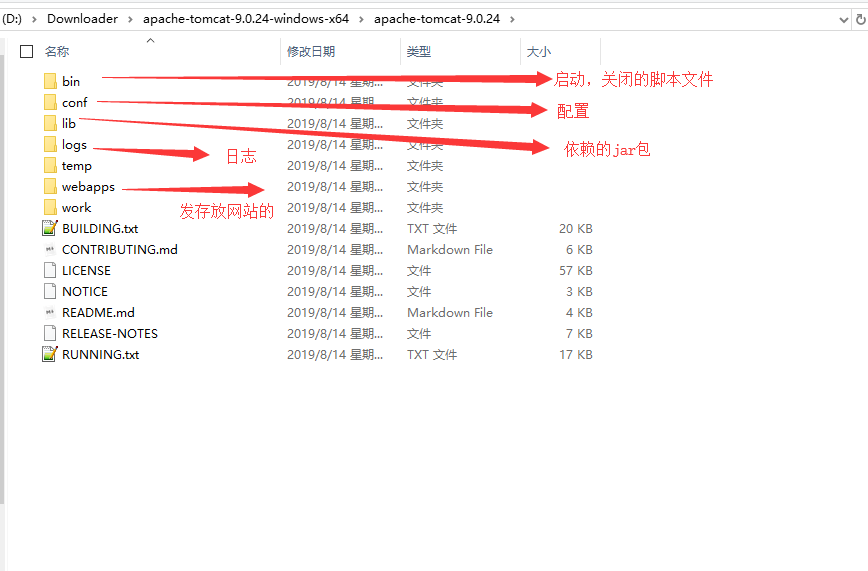
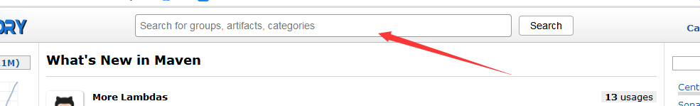
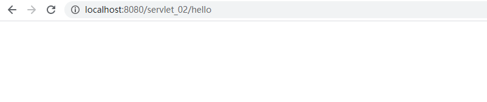
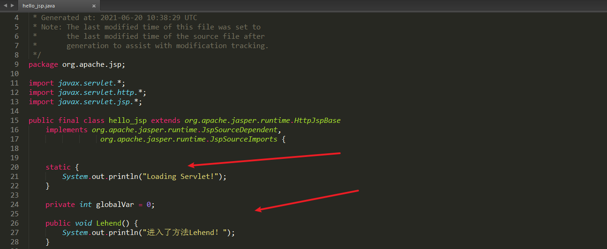

Java Web

##  **1**、基本概念

###  **1.1**、前言

web开发：

- web，网页的意思 ， 
- 静态web
  - html，css
  - 提供给所有人看的数据始终不会发生变化！
- 动态web 	

  - 淘宝，几乎是所有的网站；
  - 提供给所有人看的数据始终会发生变化，每个人在不同的时间，不同的地点看到的信息各不相
   同！

  - 技术栈：Servlet/JSP，ASP，PHP

 在Java中，动态web资源开发的技术统称为JavaWeb；

###  **1.2**、**web**应用程序

web应用程序：可以提供浏览器访问的程序；
- a.html、b.html......多个web资源，这些web资源可以被外界访问，对外界提供服务；
- 你们能访问到的任何一个页面或者资源，都存在于这个世界的某一个角落的计算机上。
- URL
- 这个统一的web资源会被放在同一个文件夹下，web应用程序--Tomcat：服务器
- 一个web应用由多部分组成 （静态web，动态web）
 - html，css，js
 -  jsp，servlet
 - Java程序
 - jar包
 - 配置文件 （Properties）

web应用程序编写完毕后，若想提供给外界访问：需要一个服务器来统一管理；
###  **1.3**、静态**web**

- *.htm, *.html,这些都是网页的后缀，如果服务器上一直存在这些东西，我们就可以直接进行读
 取。通络；

{width="6.179861111111111in" height="1.4902777777777778in"}

- 静态web存在的缺点
    - Web页面无法动态更新，所有用户看到都是同一个页面
      - 轮播图，点击特效：伪动态
      - JavaScript [实际开发中，它用的最多]
      - VBScript
    - 它无法和数据库交互（数据无法持久化，用户无法交互）
### **1.4**、动态**web**

 页面会动态展示： "Web的页面展示的效果因人而异"；

{width="6.179861111111111in" height="2.6680555555555556in"}

 缺点：

- ​	加入服务器的动态web资源出现了错误，我们需要重新编写我们的后台程序,重新发布；
  - 停机维护	

 优点：

- ​	Web页面可以动态更新，所有用户看到都不是同一个页面
- 它可以与数据库交互 （数据持久化：注册，商品信息，用户信息........）

{width="6.179861111111111in" height="3.6055555555555556in"}

 新手村：--魔鬼训练（分析原理，看源码）-- PK场

##  **2**、**web**服务器

###  **2.1**、技术讲解

 **ASP:**

- 微软：国内最早流行的就是ASP；
-  在HTML中嵌入了VB的脚本， ASP + COM；
-  在ASP开发中，基本一个页面都有几千行的业务代码，页面极其换乱
-  维护成本高！
-  C#
-  IIS

```asp
<h1>
   <h1><h1>
       <h1>
           <h1>
               <h1>
       <h1>
           <%
           System.out.println("hello")            
           %>
           <h1>
               <h1>
  <h1><h1>
<h1>
```


 **php：**

- PHP开发速度很快，功能很强大，跨平台，代码很简单 （70% , WP）
- 无法承载大访问量的情况（局限性）

 **JSP/Servlet :**

- B/S：浏览和服务器
-  C/S: 客户端和服务器
  - sun公司主推的B/S架构
  -  基于Java语言的 (所有的大公司，或者一些开源的组件，都是用Java写的)
  -  可以承载三高问题带来的影响；
  -  语法像ASP ， ASP--JSP , 加强市场强度； 

###  **2.2**、**web**服务器

 服务器是一种被动的操作，用来处理用户的一些请求和给用户一些响应信息；

 **IIS**

 微软的； ASP...,Windows中自带的 **Tomcat**

{width="4.252083333333333in" height="1.0944444444444446in"}

 面向百度编程；

 Tomcat是Apache 软件基金会（Apache Software Foundation）的Jakarta 项目中的一个核心项目，最 新的Servlet 和JSP 规范总是能在Tomcat 中得到体现，因为Tomcat 技术先进、性能稳定，而且免费，因 而深受Java 爱好者的喜爱并得到了部分软件开发商的认可，成为目前比较流行的Web 应用服务器。
 Tomcat 服务器是一个免费的开放源代码的Web 应用服务器，属于轻量级应用服务器在中小型系统和 并发访问用户不是很多的场合下被普遍使用，是开发和调试JSP 程序的首选。对于一个Java初学web的人 来说，它是最佳的选择

 Tomcat 实际上运行JSP 页面和Servlet。Tomcat最新版本为**9.0**。

 ....

 **工作3-5年之后，可以尝试手写Tomcat服务器；**
 下载tomcat：

 1. 安装 or 解压

 2. 了解配置文件及目录结构
 3. 这个东西的作用

##  **3**、**Tomcat**

###  **3.1**、 安装**tomcat**

 tomcat官网：`http://tomcat.apache.org/`

{width="6.179861111111111in" height="3.657638888888889in"}

{width="6.179861111111111in" height="2.0840277777777776in"}

###  **3.2**、**Tomcat**启动和配置

 文件夹作用：

{width="6.179861111111111in" height="4.064583333333333in"}

 **启动。关闭Tomcat**

{width="6.179861111111111in" height="1.9694444444444446in"}

 访问测试：[[http://localhost:8080/]{.ul}](http://localhost:8080/)
 可能遇到的问题：

 1. Java环境变量没有配置

 2. 闪退问题：需要配置兼容性
 3. 乱码问题：配置文件中设置

###  **3.3**、配置

{width="6.179861111111111in" height="2.803472222222222in"}

####  1、可以配置启动的端口号

- tomcat的默认端口号为：8080
-  mysql：3306
-  http：80
-  https：443

```xml
<Connector port="8081" protocol="HTTP/1.1"           connectionTimeout="20000"
          redirectPort="8443" />
```

#### 2、 可以配置主机的名称

- 默认的主机名为：localhost-127.0.0.1
-  默认网站应用存放的位置为：webapps

 ```xml
 <Host name="www.qinjiang.com"  appBase="webapps"        unpackWARs="true" autoDeploy="true">
 ```

#### 3、可以配置默认的访问路径

- 指定默认的访问路径为：webapps/struts2-showcase
- 配置如下


#### 4、 高难度面试题：

 请你谈谈网站是如何进行访问的！
 1. 输入一个域名；回车

 2. 检查本机的 C:\Windows\System32\drivers\etc\hosts配置文件下有没有这个域名映射； 

    1. 有：直接返回对应的ip地址，这个地址中，有我们需要访问的web程序，可以直接访问

    ```
    127.0.0.1   www.qinjiang.com
    ```

     2. 没有：去DNS服务器找，找到的话就返回，找不到就返回找不到；

{width="5.867361111111111in" height="2.459722222222222in"}

 3. 可以配置一下环境变量（可选性）

###  **3.4**、发布一个**web**网站

 不会就先模仿

- 将自己写的网站，放到服务器(Tomcat)中指定的web应用的文件夹（webapps）下，就可以访问了
- 复制一份ROOT，将其改名为lehend，删掉里面除了WEB-INF文件夹的其他内容
- webapps下默认的文件夹都是示例代码


默认的web.xml 配置

```xml
<web-app xmlns="http://xmlns.jcp.org/xml/ns/javaee"
  xmlns:xsi="http://www.w3.org/2001/XMLSchema-instance"
  xsi:schemaLocation="http://xmlns.jcp.org/xml/ns/javaee
                      http://xmlns.jcp.org/xml/ns/javaee/web-app_4_0.xsd"
  version="4.0"
  metadata-complete="true">
</web-app>
```


#### 网站应该有的结构

```xml
--webapps ：Tomcat服务器的web目录
	-ROOT
	-lehend ：网站的目录名
		- WEB-INF
			-classes : java程序
			-lib：web应用所依赖的jar包
			-web.xml ：网站配置文件
		- index.html 默认的首页
		- static
			-css
			-style.css
			-js
			-img
		-.....
```

 HTTP协议 ： 面试 Maven：构建工具

- Maven安装包 

Servlet 入门

- HelloWorld！
-  Servlet配置
   原理

##  **4**、**Http**

###  **4.1**、什么是**HTTP**

HTTP（超文本传输协议）是一个简单的请求-响应协议，它通常运行在TCP之上。 

- 文本：html，字符串，~ …. 
- 超文本：图片，音乐，视频，定位，地图……. 
- 80 

Https：安全的 

- 443

###  **4.2**、两个时代

 http1.0

- HTTP/1.0：客户端可以与web服务器连接后，只能获得一个web资源，断开连接

 http2.0

- HTTP/1.1：客户端可以与web服务器连接后，可以获得多个web资源。'

###  **4.3**、**Http**请求

- 客户端---发请求（Request）---服务器

 访问百度：

```
Request URL:https://www.baidu.com/ 请求地址
Request Method:GET get方法/post方法
Status Code:200 OK 状态码：200
Remote（远程） Address:14.215.177.39:443
```

```
Accept:text/html
Accept-Encoding:gzip, deflate, br
Accept-Language:zh-CN,zh;q=0.9 语言
Cache-Control:max-age=0
Connection:keep-alive
```

####  **1**、请求行

- 请求行中的请求方式：GET
-  请求方式：**Get**，**Post**，HEAD,DELETE,PUT,TRACT...
  - get：请求能够携带的参数比较少，大小有限制，会在浏览器的URL地址栏显示数据内容，不
     安全，但高效
  -  post：请求能够携带的参数没有限制，大小没有限制，不会在浏览器的URL地址栏显示数据内
     容，安全，但不高效。

####  **2**、消息头

```http
Accept：告诉浏览器，它所支持的数据类型
Accept-Encoding：支持哪种编码格式 GBK UTF-8 GB2312 ISO8859-1
Accept-Language：告诉浏览器，它的语言环境
Cache-Control：缓存控制
Connection：告诉浏览器，请求完成是断开还是保持连接
HOST：主机..../.
```

###  **4.4**、**Http**响应

- 服务器---响应-----客户端

 百度：

```http
Cache-Control:private 缓存控制
Connection:Keep-Alive 连接
Content-Encoding:gzip 编码
Content-Type:text/html 类型
```

####  **1.**响应体

```http
Accept：告诉浏览器，它所支持的数据类型
Accept-Encoding：支持哪种编码格式 GBK UTF-8 GB2312 ISO8859-1
Accept-Language：告诉浏览器，它的语言环境
Cache-Control：缓存控制
Connection：告诉浏览器，请求完成是断开还是保持连接
HOST：主机..../.
Refresh：告诉客户端，多久刷新一次；
Location：让网页重新定位；
```

####  **2**、响应状态码

 200：请求响应成功 200
 3xx：请求重定向

- 重定向：你重新到我给你新位置去；

4xx：找不到资源 404

- 资源不存在；

 5xx：服务器代码错误 500 502:网关错误

 **常见面试题：**
 	当你的浏览器中地址栏输入地址并回车的一瞬间到页面能够展示回来，经历了什么？

##  **5**、**Maven**

 我为什么要学习这个技术？

 1. 在Javaweb开发中，需要使用大量的jar包，我们手动去导入；

 2. 如何能够让一个东西自动帮我导入和配置这个jar包。
 由此，Maven诞生了！

###  **5.1 Maven**项目架构管理工具

 我们目前用来就是方便导入jar包的！
 Maven的核心思想：**约定大于配置**

- 有约束，不要去违反。
   Maven会规定好你该如何去编写我们的Java代码，必须要按照这个规范来；

###  **5.2** 下载安装**Maven**

官网; https://maven.apache.org/

{width="6.179861111111111in" height="3.032638888888889in"}

 下载完成后，解压即可；

#### 如何下载Maven历史版本?

访问：https://maven.apache.org/download.cgi


选择对应版本即可：https://archive.apache.org/dist/maven/maven-3/

###  **5.3** 配置环境变量

 在我们的系统环境变量中
 配置如下配置：

- M2_HOME maven目录下的bin目录 eg：E:\maven\apache-maven-3.6.2\bin
-  MAVEN_HOME maven的目录 eg：E:\maven\apache-maven-3.6.2
-  在系统的path中配置 %MAVEN_HOME%\bin


 测试Maven是否安装成功，保证必须配置完毕！

###  **5.4** 阿里云镜像

{width="6.179861111111111in" height="1.8652777777777778in"}

- 镜像：mirrors

  - 作用：加速我们的下载

- 国内建议使用阿里云的镜像

```xml
<mirror>
<id>nexus-aliyun</id>
<mirrorOf>*,!jeecg,!jeecg-snapshots</mirrorOf>
<name>Nexus aliyun</name>
<url>http://maven.aliyun.com/nexus/content/groups/public</url>
</mirror>
```


###  **5.5** 配置本地仓库

 在本地的仓库，远程仓库；
 **建立一个本地仓库**：localRepository

```xml
<localRepository>E:\maven\apache-maven-3.6.2\maven-repo</localRepository>
```


###  **5.6**、在**IDEA**中使用**Maven**

#### 1、启动IDEA

#### 2、创建一个MavenWeb项目 {width="5.867361111111111in" height="4.002083333333333in"}

{width="5.867361111111111in" height="0.9694444444444444in"}


{width="5.867361111111111in" height="2.876388888888889in"}

{width="5.867361111111111in" height="0.9902777777777778in"}

{width="5.867361111111111in" height="4.033333333333333in"}

#### 3、等待项目初始化完毕

{width="5.867361111111111in" height="3.1993055555555556in"}

{width="5.867361111111111in" height="3.209722222222222in"}

#### 4、观察maven仓库中多了什么东西？

#### 5、IDEA中的Maven设置

- 注意：IDEA项目创建成功后，看一眼Maven的配置

{width="5.867361111111111in" height="4.022916666666666in"}

{width="5.867361111111111in" height="3.9916666666666667in"}

#### 6、到这里，Maven在IDEA中的配置和使用就OK了!

### **5.7**、创建一个普通的**Maven**项目

{width="6.179861111111111in" height="4.189583333333333in"}

{width="6.179861111111111in" height="1.9902777777777778in"}

 这个只有在Web应用下才会有！

{width="5.263194444444444in" height="1.8027777777777778in"}

###  **5.8** 标记文件夹功能

{width="6.179861111111111in" height="5.909027777777778in"}{width="6.179861111111111in" height="3.501388888888889in"}

{width="6.179861111111111in" height="3.720138888888889in"}

{width="6.179861111111111in" height="3.7305555555555556in"}

###  **5.9** 在 **IDEA**中配置**Tomcat** {width="6.179861111111111in" height="1.2194444444444446in"}

{width="6.179861111111111in" height="3.98125in"}{width="6.179861111111111in" height="3.6993055555555556in"}

{width="6.179861111111111in" height="3.98125in"}

 解决警告问题
 必须要的配置：为什么会有这个问题：我们访问一个网站，需要指定一个文件夹名字； {width="6.179861111111111in" height="3.9604166666666667in"}

{width="6.179861111111111in" height="5.220833333333333in"}

{width="6.179861111111111in" height="1.4590277777777778in"}

{width="6.179861111111111in" height="2.2090277777777776in"}

###  **5.10 pom**文件

 pom.xml 是Maven的核心配置文件

{width="6.179861111111111in" height="2.615972222222222in"}

```xml
<?xml version="1.0" encoding="UTF-8"?>
<!--Maven版本和头文件-->
<project xmlns="http://maven.apache.org/POM/4.0.0"
xmlns:xsi="http://www.w3.org/2001/XMLSchema-instance"
xsi:schemaLocation="http://maven.apache.org/POM/4.0.0
http://maven.apache.org/xsd/maven-4.0.0.xsd">
<modelVersion>4.0.0</modelVersion>
<!--这里就是我们刚才配置的GAV-->
<groupId>com.kuang</groupId>
<artifactId>javaweb-01-maven</artifactId>
<version>1.0-SNAPSHOT</version>
<!--Package：项目的打包方式
jar：java应用
war：JavaWeb应用
-->
<packaging>war</packaging>
<!--配置-->
<properties>
<!--项目的默认构建编码-->
<project.build.sourceEncoding>UTF-8</project.build.sourceEncoding>
<!--编码版本-->
<maven.compiler.source>1.8</maven.compiler.source>
<maven.compiler.target>1.8</maven.compiler.target>
</properties>
<!--项目依赖-->
<dependencies>
<!--具体依赖的jar包配置文件-->
<dependency>
<groupId>junit</groupId>
<artifactId>junit</artifactId>
<version>4.11</version>
</dependency>
</dependencies>
<!--项目构建用的东西-->
<build>
<finalName>javaweb-01-maven</finalName>
<pluginManagement><!-- lock down plugins versions to avoid using Maven
defaults (may be moved to parent pom) -->
<plugins>
<plugin>
<artifactId>maven-clean-plugin</artifactId>
<version>3.1.0</version>
</plugin>
<!-- see http://maven.apache.org/ref/current/maven-core/defaultbindings.html#Plugin_bindings_for_war_packaging -->
<plugin>
<artifactId>maven-resources-plugin</artifactId>
<version>3.0.2</version>
</plugin>
<plugin>
<artifactId>maven-compiler-plugin</artifactId>
<version>3.8.0</version>
</plugin>
<plugin>
<artifactId>maven-surefire-plugin</artifactId>
<version>2.22.1</version>
</plugin>
<plugin>
<artifactId>maven-war-plugin</artifactId>
<version>3.2.2</version>
</plugin>
<plugin>
<artifactId>maven-install-plugin</artifactId>
<version>2.5.2</version>
</plugin>
<plugin>
<artifactId>maven-deploy-plugin</artifactId>
<version>2.8.2</version>
</plugin>
</plugins>
</pluginManagement>
</build>
</project>
```

{width="6.179861111111111in" height="3.1993055555555556in"}

 maven由于他的约定大于配置，我们之后可以能遇到我们写的配置文件，无法被导出或者生效的问题， 解决方案：

```xml
<!--在build中配置resources，来防止我们资源导出失败的问题-->
<build>
<resources>
<resource>
<directory>src/main/resources</directory>
<includes>
<include>**/*.properties</include>
<include>**/*.xml</include>
</includes>
<filtering>true</filtering>
</resource>
<resource>
<directory>src/main/java</directory>
<includes>
<include>**/*.properties</include>
<include>**/*.xml</include>
</includes>
<filtering>true</filtering>
</resource>
</resources>
</build>
```

###  **5.11 IDEA**操作 {width="6.179861111111111in" height="2.647222222222222in"}

{width="6.179861111111111in" height="4.825in"}

###  **5.12**解决遇到的问题

#### 1、Maven 3.6.2

- 解决方法：降级为3.6.1

{width="3.428472222222222in" height="0.2708333333333333in"}

#### 2、Tomcat闪退

#### 3、IDEA中每次都要重复配置Maven

- **在IDEA中的全局默认配置中去配置** 

{width="5.867361111111111in" height="3.178472222222222in"}

{width="5.867361111111111in" height="3.522222222222222in"}

#### 4、Maven项目中Tomcat无法配置(maven 3.6.2存在，3.6.1不存在这个问题)

#### 5、maven默认web项目中的web.xml版本问题

{width="5.867361111111111in" height="1.9694444444444446in"}

#### 6、替换为tomcat的webapp4.0版本和tomcat一致

- 其实就是用的`apache-tomcat-9.0.46\webapps\ROOT\WEB-INF\web.xml`中的配置文件，兼容性最好

```xml
<?xml version="1.0" encoding="UTF-8"?>
<web-app xmlns="http://xmlns.jcp.org/xml/ns/javaee"
         xmlns:xsi="http://www.w3.org/2001/XMLSchema-instance"
         xsi:schemaLocation="http://xmlns.jcp.org/xml/ns/javaee
                      http://xmlns.jcp.org/xml/ns/javaee/web-app_4_0.xsd"
         version="4.0"
         metadata-complete="true">
</web-app>
```

#### 7、Maven仓库的使用

地址：https://mvnrepository.com/{width="5.867361111111111in" height="0.8861111111111111in"}

{width="5.867361111111111in" height="3.272222222222222in"}{width="5.867361111111111in" height="4.98125in"}

{width="5.867361111111111in" height="2.6055555555555556in"}

##  **6**、**Servlet**

###  **6.1**、**Servlet**简介

- Servlet就是sun公司开发动态web的一门技术
- Sun在这些API中提供一个接口叫做：Servlet，如果你想开发一个Servlet程序，只需要完成两个小
   步骤：
  - 编写一个类，实现Servlet接口
  - 把开发好的Java类部署到web服务器中。

 **把实现了Servlet接口的Java程序叫做，Servlet****

###  **6.2**、**HelloServlet**

 Serlvet接口Sun公司有两个默认的实现类：HttpServlet，GenericServlet

#### 1、构建一个普通的Maven项目，删掉里面的src目录，以后我们的学习就在这个项目里面建立

Moudel；这个空的工程就是Maven主工程；

#### 2、关于Maven父子工程的理解：

​	父项目中会有

```xml
<modules>
        <module>servlet-01</module>
    </modules>
```

​	子项目会有

```xml
<parent>
<artifactId>servlet-01 Maven Webapp</artifactId>
<groupId>com.lehend</groupId>
<version>1.0-SNAPSHOT</version>
</parent>
```

​	父项目中的java子项目可以直接使用

​	`son extends father`

####  3、 Maven环境优化

1. 修改web.xml为最新的 
2. 将maven的结构搭建完整

#### 4、编写一个Servlet程序

{width="5.867361111111111in" height="5.022916666666666in"}

 1. 编写一个普通类

 2. 实现Servlet接口，这里我们直接继承HttpServlet

 ```java
package com.lehend.servlet;

import javax.servlet.ServletException;
import javax.servlet.http.HttpServlet;
import javax.servlet.http.HttpServletRequest;
import javax.servlet.http.HttpServletResponse;
import java.io.IOException;
import java.io.PrintWriter;

public class HelloServlet extends HttpServlet {
    /*
    从写get和post方法
     */
    @Override
    protected void doGet(HttpServletRequest req, HttpServletResponse resp) throws ServletException, IOException {
        PrintWriter writer = resp.getWriter(); //获取响应流
        writer.print("hello servlet!");
    }

    @Override
    protected void doPost(HttpServletRequest req, HttpServletResponse resp) throws ServletException, IOException {
        doGet(req,resp);
    }
}
 ```

#### 5、编写Servlet的映射

**为什么需要映射：我们写的是JAVA程序，但是要通过浏览器访问，而浏览器需要连接web服务器， 所以我们需要再web服务中注册我们写的Servlet，还需给他一个浏览器能够访问的路径；**

```xml
<!--注册Servlet-->
<servlet>
        <servlet-name>HelloServlet</servlet-name>
        <servlet-class>com.lehend.servlet.HelloServlet</servlet-class>
    </servlet>
<!--Servlet的请求路径-->
    <servlet-mapping>
        <servlet-name>HelloServlet</servlet-name>
        <url-pattern>/HelloServlet-01</url-pattern>
    </servlet-mapping>
```

#### 6、配置Tomcat

​	注意：配置项目发布的路径就可以了

#### 7、启动测试，OK！

###  **6.3**、**Servlet**原理

 Servlet是由Web服务器调用，web服务器在收到浏览器请求之后，会：

{width="6.179861111111111in" height="4.575in"}

####  **6.4**、**Mapping**问题

#### 1、一个Servlet可以指定一个映射路径

```xml
<servlet-mapping>
<servlet-name>hello</servlet-name>
<url-pattern>/hello</url-pattern>
</servlet-mapping>
```

#### 2、一个Servlet可以指定多个映射路径

```xml
<servlet-mapping>
<servlet-name>hello</servlet-name>
<url-pattern>/hello</url-pattern>
</servlet-mapping>
<servlet-mapping>
<servlet-name>hello</servlet-name>
<url-pattern>/hello2</url-pattern>
</servlet-mapping>
<servlet-mapping>
<servlet-name>hello</servlet-name>
<url-pattern>/hello3</url-pattern>
</servlet-mapping>
<servlet-mapping>
<servlet-name>hello</servlet-name>
<url-pattern>/hello4</url-pattern>
</servlet-mapping>
<servlet-mapping>
<servlet-name>hello</servlet-name>
<url-pattern>/hello5</url-pattern>
</servlet-mapping>
```

####  3、一个Servlet可以指定通用映射路径

```xml
<servlet-mapping>
<servlet-name>hello</servlet-name>
<url-pattern>/hello/*</url-pattern>
</servlet-mapping>
```

####  4、默认请求路径

```xml
<!--默认请求路径-->
<servlet-mapping>
<servlet-name>hello</servlet-name>
<url-pattern>/*</url-pattern>
</servlet-mapping>
```

####  5、指定一些后缀或者前缀等等....

```xml
<!--可以自定义后缀实现请求映射
注意点，*前面不能加项目映射的路径
hello/sajdlkajda.qinjiang
-->
<servlet-mapping>
<servlet-name>hello</servlet-name>
<url-pattern>*.qinjiang</url-pattern>
</servlet-mapping>
```

#### 6、优先级问题 

​	指定了固有的映射路径优先级最高，如果找不到就会走默认的处理请求； 

```xml
<!--404-->
<servlet>
        <servlet-name>HelloServlet</servlet-name>
        <servlet-class>com.lehend.servlet.HelloServlet</servlet-class>
    </servlet>
    <servlet-mapping>
        <servlet-name>HelloServlet</servlet-name>
        <url-pattern>/HelloServlet-01</url-pattern>
    </servlet-mapping>
    <servlet>
        <servlet-name>errorServlet</servlet-name>
        <servlet-class>com.lehend.servlet.ErrorServlet</servlet-class>
    </servlet>
    <servlet-mapping>
        <servlet-name>errorServlet</servlet-name>
        <url-pattern>/*</url-pattern>
    </servlet-mapping>
```

### **6.5**、**ServletContext**

 web容器在启动的时候，它会为每个web程序都创建一个对应的ServletContext对象，它代表了当前的
 web应用；

####  **1**、共享数据

 我在这个Servlet中保存的数据，可以在另外一个servlet中拿到；

 ```java
public class HelloServlet extends HttpServlet {
    @Override
    protected void doGet(HttpServletRequest req, HttpServletResponse resp) throws ServletException, IOException {
        //this.getInitParameter() 初始化参数
		//this.getServletConfig() Servlet配置
		//this.getServletContext() Servlet上下文
        ServletContext servletContext = this.getServletContext();
        String username = "邹文";
        servletContext.setAttribute("username", username);//将一个数据保存在了
    }

    @Override
    protected void doPost(HttpServletRequest req, HttpServletResponse resp) throws ServletException, IOException {
        doGet(req, resp);
    }
}
 ```

```java
public class getServlet extends HttpServlet {
    @Override
    protected void doGet(HttpServletRequest req, HttpServletResponse resp) throws ServletException, IOException {
        ServletContext servletContext = this.getServletContext();
        resp.setContentType("text/html");
        resp.setCharacterEncoding("utf-8");
        String username = (String) servletContext.getAttribute("username");
//        输出到页面
        resp.getWriter().print("name is " + username);
    }

    @Override
    protected void doPost(HttpServletRequest req, HttpServletResponse resp) throws ServletException, IOException {
        doGet(req, resp);
    }
}
```

```xml
<servlet>
        <servlet-name>hello</servlet-name>
        <servlet-class>com.lehend.servlet.HelloServlet</servlet-class>
        
    </servlet>
    <servlet-mapping>
        <servlet-name>hello</servlet-name>
        <url-pattern>/hello</url-pattern>
    </servlet-mapping>
    <servlet>
        <servlet-name>getServlet</servlet-name>
        <servlet-class>com.lehend.servlet.getServlet</servlet-class>
    </servlet>
    <servlet-mapping>
        <servlet-name>getServlet</servlet-name>
        <url-pattern>/getServlet</url-pattern>
    </servlet-mapping>
```

测试访问结果；




####  **2**、获取初始化参数

```xml
<!--配置一些web应用初始化参数-->
<context-param>
        <param-name>mysql</param-name>
        <param-value>jdbc:mysql://localhost:3306/mybatis</param-value>
    </context-param>
```

```java
protected void doGet(HttpServletRequest req, HttpServletResponse resp) throws ServletException, IOException {
        ServletContext servletContext = this.getServletContext();
        String mysqlParam = servletContext.getInitParameter("mysql");
        resp.getWriter().print(mysqlParam);
    }
```

####  **3**、请求转发-RequestDispatcher

```java
    @Override
    protected void doGet(HttpServletRequest req, HttpServletResponse resp) throws ServletException, IOException {
        ServletContext servletContext = this.getServletContext();
//        请求转发
        servletContext.getRequestDispatcher("/GetMysqlParam").forward(req,resp);
    }
```

{width="6.179861111111111in" height="3.553472222222222in"}

####  **4**、读取资源文件

 Properties

- 在java目录下新建properties

- 在resources目录下新建properties

 发现：都被打包到了同一个路径下：classes，我们俗称这个路径为classpath:

 思路：需要一个文件流；

```xml
username=root
password=toor
```

```java
public class GetDbProperties extends HttpServlet {
    @Override
    protected void doGet(HttpServletRequest req, HttpServletResponse resp) throws ServletException, IOException {

        InputStream inputStream = this.getServletContext().getResourceAsStream("/WEB-INF/classes/db.properties");
//        InputStream inputStream = this.getServletContext().getResourceAsStream("/WEB-INF/classes/com/lehend/servlet/database.properties");

        Properties properties = new Properties();
        properties.load(inputStream);
        String username = properties.getProperty("username");
        String password = properties.getProperty("password");
        resp.getWriter().print("username:"+username+", password:" + password);
    }
    @Override
    protected void doPost(HttpServletRequest req, HttpServletResponse resp) throws ServletException, IOException {
        doGet(req, resp);
    }
}
```

 访问测试即可ok；

###  **6.6**、**HttpServletResponse**

 web服务器接收到客户端的http请求，针对这个请求，分别创建一个代表请求的HttpServletRequest对
 象，代表响应的一个HttpServletResponse；

- ​	如果要获取客户端请求过来的参数：找HttpServletRequest
-  如果要给客户端响应一些信息：找HttpServletResponse

####  **1**、简单分类

 负责向浏览器发送数据的方法

```JAVA
ServletOutputStream getOutputStream() throws IOException;
PrintWriter getWriter() throws IOException;
```

 负责向浏览器发送响应头的方法

```JAVA
void setCharacterEncoding(String var1);
void setContentLength(int var1);
void setContentLengthLong(long var1);
void setContentType(String var1);
void setDateHeader(String var1, long var2);
void addDateHeader(String var1, long var2);
void setHeader(String var1, String var2);
void addHeader(String var1, String var2);
void setIntHeader(String var1, int var2);
void addIntHeader(String var1, int var2);
```

 响应的状态码

```JAVA
int SC_CONTINUE = 100;
int SC_SWITCHING_PROTOCOLS = 101;
int SC_OK = 200;
int SC_CREATED = 201;
int SC_ACCEPTED = 202;
int SC_NON_AUTHORITATIVE_INFORMATION = 203;
int SC_NO_CONTENT = 204;
int SC_RESET_CONTENT = 205;
int SC_PARTIAL_CONTENT = 206;
int SC_MULTIPLE_CHOICES = 300;
int SC_MOVED_PERMANENTLY = 301;
int SC_MOVED_TEMPORARILY = 302;
int SC_FOUND = 302;
int SC_SEE_OTHER = 303;
int SC_NOT_MODIFIED = 304;
int SC_USE_PROXY = 305;
int SC_TEMPORARY_REDIRECT = 307;
int SC_BAD_REQUEST = 400;
int SC_UNAUTHORIZED = 401;
int SC_PAYMENT_REQUIRED = 402;
int SC_FORBIDDEN = 403;
int SC_NOT_FOUND = 404;
int SC_METHOD_NOT_ALLOWED = 405;
int SC_NOT_ACCEPTABLE = 406;
int SC_PROXY_AUTHENTICATION_REQUIRED = 407;
int SC_REQUEST_TIMEOUT = 408;
int SC_CONFLICT = 409;
int SC_GONE = 410;
int SC_LENGTH_REQUIRED = 411;
int SC_PRECONDITION_FAILED = 412;
int SC_REQUEST_ENTITY_TOO_LARGE = 413;
int SC_REQUEST_URI_TOO_LONG = 414;
int SC_UNSUPPORTED_MEDIA_TYPE = 415;
int SC_REQUESTED_RANGE_NOT_SATISFIABLE = 416;
int SC_EXPECTATION_FAILED = 417;
int SC_INTERNAL_SERVER_ERROR = 500;
int SC_NOT_IMPLEMENTED = 501;
int SC_BAD_GATEWAY = 502;
int SC_SERVICE_UNAVAILABLE = 503;
int SC_GATEWAY_TIMEOUT = 504;
int SC_HTTP_VERSION_NOT_SUPPORTED = 505;
```

####  **2**、常见应用

##### 1.向浏览器输出消息 （一直在讲，就不说了）

```java
ServletOutputStream getOutputStream() throws IOException;
PrintWriter getWriter() throws IOException;
```

##### 2.下载文件

1. 要获取下载文件的路径
2. 下载的文件名是啥？
3. 设置想办法让浏览器能够支持下载我们需要的东西
4. 获取下载文件的输入流
5. 创建缓冲区
6. 获取OutputStream对象
7. 将FileOutputStream流写入到buffer缓冲区
8. 使用OutputStream将缓冲区中的数据输出到客户端！

```java
@Override
protected void doGet(HttpServletRequest req, HttpServletResponse resp)
throws ServletException, IOException {
// 1. 要获取下载文件的路径
String realPath = "F:\\班级管理\\西开【19525】\\2、代码\\JavaWeb\\javaweb02-servlet\\response\\target\\classes\\秦疆.png";
System.out.println("下载文件的路径："+realPath);
// 2. 下载的文件名是啥？
String fileName = realPath.substring(realPath.lastIndexOf("\\") + 1);
// 3. 设置想办法让浏览器能够支持(Content-Disposition)下载我们需要的东西,中文文件
名URLEncoder.encode编码，否则有可能乱码
resp.setHeader("ContentDisposition","attachment;filename="+URLEncoder.encode(fileName,"UTF-8"));
// 4. 获取下载文件的输入流
FileInputStream in = new FileInputStream(realPath);
// 5. 创建缓冲区
int len = 0;
byte[] buffer = new byte[1024];
// 6. 获取OutputStream对象
ServletOutputStream out = resp.getOutputStream();
// 7. 将FileOutputStream流写入到buffer缓冲区,使用OutputStream将缓冲区中的数据
输出到客户端！
while ((len=in.read(buffer))>0){
out.write(buffer,0,len);
}
in.close();
out.close();
}
```

####  **3**、验证码功能

 验证怎么来的？

- 前端实现

- 后端实现，需要用到 Java 的图片类，生产一个图片

```JAVA 
package com.lehend;

import javax.imageio.ImageIO;
import javax.servlet.ServletException;
import javax.servlet.http.HttpServlet;
import javax.servlet.http.HttpServletRequest;
import javax.servlet.http.HttpServletResponse;
import java.awt.*;
import java.awt.image.BufferedImage;
import java.io.IOException;
import java.util.Random;

public class ImageServlet extends HttpServlet {
    @Override
    protected void doGet(HttpServletRequest req, HttpServletResponse resp)
            throws ServletException, IOException {
//如何让浏览器3秒自动刷新一次;
        resp.setHeader("refresh","3");
//在内存中创建一个图片
        BufferedImage image = new
                BufferedImage(80,20,BufferedImage.TYPE_INT_RGB);
//得到图片
        Graphics2D g = (Graphics2D) image.getGraphics(); //笔
//设置图片的背景颜色
        g.setColor(Color.white);
        g.fillRect(0,0,80,20);
//给图片写数据
        g.setColor(Color.BLUE);
        g.setFont(new Font(null,Font.BOLD,20));
        g.drawString(makeNum(),0,20);
//告诉浏览器，这个请求用图片的方式打开
        resp.setContentType("image/jpeg");
//网站存在缓存，不让浏览器缓存
        resp.setDateHeader("expires",-1);
        resp.setHeader("Cache-Control","no-cache");
        resp.setHeader("Pragma","no-cache");
//把图片写给浏览器
        ImageIO.write(image,"jpg", resp.getOutputStream());
    }
    //生成随机数
    private String makeNum(){
        Random random = new Random();
        String num = random.nextInt(9999999) + "";
        StringBuffer sb = new StringBuffer();
        for (int i = 0; i < 7-num.length() ; i++) {
            sb.append("0");
        }
        num = sb.toString() + num;
        return num;
    }
    @Override
    protected void doPost(HttpServletRequest req, HttpServletResponse resp)
            throws ServletException, IOException {
        doGet(req, resp);
    }
}
```

####  **4**、实现重定向

{width="4.0125in" height="2.3868055555555556in"}

 B一个web资源收到客户端A请求后，B他会通知A客户端去访问另外一个web资源C，这个过程叫重定向 

常见场景：

- 用户登录

```JAVA
void sendRedirect(String var1) throws IOException;
```

 测试：

```JAVA
public class SendRedirect extends HttpServlet {
    @Override
    protected void doGet(HttpServletRequest req, HttpServletResponse resp) throws
            ServletException, IOException {
/*
resp.setHeader("Location","/r/img");
resp.setStatus(302);
*/
        resp.sendRedirect("/img");//重定向到验证码页面
    }
}

```

 面试题：请你聊聊重定向和转发的区别？

 相同点

- 页面都会实现跳转

 不同点

- 请求转发的时候，url不会产生变化
-  重定向时候，url地址栏会发生变化；

{width="6.179861111111111in" height="3.5118055555555556in"}

####  **5**、简单实现登录重定向

```HTML
<html>
<body>
<%--这里提交的路径，需要寻找到项目的路径--%>
<%--${pageContext.request.contextPath}代表当前的项目--%>
<form action="${pageContext.request.contextPath}/login" method="get">
    用户名：<input type="text" name="username"> <br>
    密码：<input type="password" name="password"> <br>
    <input type="submit">
</form>

</body>
</html>
```

```JAVA
public class LoginTest extends HttpServlet {
    @Override
    protected void doGet(HttpServletRequest req, HttpServletResponse resp) throws ServletException, IOException {
        System.out.println("用户开始登录");
        String username = req.getParameter("username");
        String password = req.getParameter("password");

        System.out.println("username: " + username + "password: " + password);
        resp.sendRedirect("/response/success.jsp");

    }

    @Override
    protected void doPost(HttpServletRequest req, HttpServletResponse resp) throws ServletException, IOException {
        super.doGet(req, resp);
    }
}
```

```XML
<servlet>
        <servlet-name>LoginTest</servlet-name>
        <servlet-class>com.lehend.LoginTest</servlet-class>
    </servlet>

    <servlet-mapping>
        <servlet-name>LoginTest</servlet-name>
        <url-pattern>/login</url-pattern>
    </servlet-mapping>
```

```XML
<%@ page contentType="text/html;charset=UTF-8" language="java" %>
<html>
<head>
<title>Title</title>
</head>
<body>
<h1>Success</h1>
</body>
</html>
```

**pom.xml中的jsp依赖**

```XML
<dependency>
      <groupId>javax.servlet.jsp.jstl</groupId>
      <artifactId>jstl-api</artifactId>
      <version>1.2</version>
    </dependency>
```


###  **6.7**、**HttpServletRequest**

 HttpServletRequest代表客户端的请求，用户通过Http协议访问服务器，HTTP请求中的所有信息会被封 装到HttpServletRequest，通过这个HttpServletRequest的方法，获得客户端的所有信息；

{width="6.002777777777778in" height="3.8041666666666667in"}

{width="6.148611111111111in" height="3.908333333333333in"}

 获取参数，请求转发

{width="6.179861111111111in" height="1.854861111111111in"}

```jsp
<%@ page contentType="text/html;charset=UTF-8" language="java" %>
<html>
<head>
    <form action="${pageContext.request.contextPath}/login" method="post">
        用户名：<input type="text" name="username"> <br>
        密码：<input type="password" name="password"> <br>
        爱好：
        <input type="checkbox" name="hobbies" value="美女">美女
        <input type="checkbox" name="hobbies" value="代码">代码
        <input type="checkbox" name="hobbies" value="唱歌">唱歌
        <input type="checkbox" name="hobbies" value="电影">电影
        <br>
        <input type="submit">
    </form>
</head>
<body>

</body>
</html>

```

 ```JAVA
package com.lehend;

import javax.servlet.ServletException;
import javax.servlet.http.HttpServlet;
import javax.servlet.http.HttpServletRequest;
import javax.servlet.http.HttpServletResponse;
import java.io.IOException;
import java.util.Arrays;

public class RequestTest extends HttpServlet {
    @Override
    protected void doGet(HttpServletRequest req, HttpServletResponse resp) throws ServletException, IOException {
        super.doPost(req, resp);
    }

    @Override
    protected void doPost(HttpServletRequest req, HttpServletResponse resp) throws ServletException, IOException {


        req.setCharacterEncoding("UTF-8");
        String username = req.getParameter("username");
        String password = req.getParameter("password");
        String[] hobbies = req.getParameterValues("hobbies");
        System.out.println("username: " + username + "password: " + password);
        System.out.println(Arrays.toString(hobbies));

//        resp.setCharacterEncoding("UTF-8");

        req.getRequestDispatcher("/success.jsp").forward(req, resp);
    }


}
 ```

面试题：请你聊聊重定向和转发的区别？ 

相同点 

- 页面都会实现跳转 

不同点 

- 请求转发的时候，url不会产生变化 307 
- 重定向时候，url地址栏会发生变化； 302

##  **7**、**Cookie**、**Session**

###  **7.1**、会话

 **会话：**用户打开一个浏览器，点击了很多超链接，访问多个web资源，关闭浏览器，这个过程可以称之
 为会话；

 **有状态会话：**一个同学来过教室，下次再来教室，我们会知道这个同学，曾经来过，称之为有状态会
 话；

 **你能怎么证明你是西开的学生？**

 你 	西开

 1. 发票 	西开给你发票

 2. 学校登记    西开标记你来过了

 **一个网站，怎么证明你来过？**
 客户端 服务端

 1. 服务端给客户端一个 信件，客户端下次访问服务端带上信件就可以了； cookie

 2. 服务器登记你来过了，下次你来的时候我来匹配你； seesion

###  **7.2**、保存会话的两种技术

 **cookie**

- ​	客户端技术 （响应，请求）

 **session**

- 服务器技术，利用这个技术，可以保存用户的会话信息？ 我们可以把信息或者数据放在Session
   中！

 常见常见：网站登录之后，你下次不用再登录了，第二次访问直接就上去了！

###  **7.3**、**Cookie**

{width="6.179861111111111in" height="4.1375in"}

#### 1、从请求中拿到cookie信息

#### 2、服务器响应给客户端cookie

 ```JAVA
Cookie[] cookies = req.getCookies(); //获得Cookie
cookie.getName(); //获得cookie中的key
cookie.getValue(); //获得cookie中的vlaue
new Cookie("lastLoginTime", System.currentTimeMillis()+""); //新建一个cookie
cookie.setMaxAge(24*60*60); //设置cookie的有效期
resp.addCookie(cookie); //响应给客户端一个cookie
 ```


**cookie**：**一般会保存在本地的 用户目录下** **appdata**；

 一个网站cookie是否存在上限！聊聊细节问题

- 一个Cookie只能保存一个信息；
- 一个web站点可以给浏览器发送多个cookie，最多存放20个cookie；
- Cookie大小有限制4kb； 
- 300个cookie浏览器上限

 **功能代码**

```java
package com.lehend;

import javax.servlet.ServletException;
import javax.servlet.http.Cookie;
import javax.servlet.http.HttpServlet;
import javax.servlet.http.HttpServletRequest;
import javax.servlet.http.HttpServletResponse;
import java.io.IOException;
import java.io.PrintWriter;
import java.util.Date;

public class CookieTest extends HttpServlet {
    @Override
    protected void doGet(HttpServletRequest req, HttpServletResponse resp) throws ServletException, IOException {
//        解决中文乱码
        req.setCharacterEncoding("utf-8");
        resp.setCharacterEncoding("utf-8");

        PrintWriter out = resp.getWriter();

//        服务器从客户端获取cookie，这里的cookie的客户端的访问服务器的时间
        Cookie[] cookies = req.getCookies();
//        判断cookie是否存在，如果不存在，说明该浏览器的用户之前没有访问过
        if (cookies != null) {
//            如果存在就打印上一次的访问时间
            out.write("你上一次的访问时间:");
            for (int i = 0; i < cookies.length; i++) {
                Cookie cookie = cookies[i];
//                判断cookie数组中的的name是否是之前访问时设置的name
                if (cookie.getName().equals("lastLoginTime")) {
//                    获取cookie的值，这里是访问时间
                    long lastLoginTime = Long.parseLong(cookie.getValue());
                    Date date = new Date(lastLoginTime);
                    out.write(date.toLocaleString());
                }
            }
        }else {
            out.write("这是你第一次访问本网站");
        }
//        服务器给客户端设置一个cookie
        Cookie cookie = new Cookie("lastLoginTime",String.valueOf(System.currentTimeMillis()));
//        设置cookie的有效期为1天
        cookie.setMaxAge(24*60*60);
//        将cookie添加到响应中发送给而客户端
        resp.addCookie(cookie);

    }

    @Override
    protected void doPost(HttpServletRequest req, HttpServletResponse resp) throws ServletException, IOException {
        super.doPost(req, resp);
    }
}
```

**可以在此处进行cookie编辑和查看**


 **删除Cookie；**

- 不设置有效期，关闭浏览器，自动失效；
- 设置有效期时间为 0 ；

 **功能代码**

```java
package com.lehend;

import javax.servlet.ServletException;
import javax.servlet.http.Cookie;
import javax.servlet.http.HttpServlet;
import javax.servlet.http.HttpServletRequest;
import javax.servlet.http.HttpServletResponse;
import java.io.IOException;

public class DeleteCookie extends HttpServlet {
    @Override
    protected void doGet(HttpServletRequest req, HttpServletResponse resp) throws ServletException, IOException {
//        创建一个cookie，名字必须和要删除的名字一致
        Cookie cookie = new Cookie("lastLoginTime",String.valueOf(System.currentTimeMillis()));
//        将cookie有效期设置为0
        cookie.setMaxAge(0);
        resp.addCookie(cookie);
    }

    @Override
    protected void doPost(HttpServletRequest req, HttpServletResponse resp) throws ServletException, IOException {
        super.doGet(req, resp);
    }
}
```

**（cookie中文数据传递）中文乱码问题解决**

 **编码解码：**

```java
URLEncoder.encode("Lehend邹","utf-8")
URLDecoder.decode(cookie.getValue(),"UTF-8")
```

功能代码

```java
package com.lehend;

import javax.servlet.ServletException;
import javax.servlet.http.Cookie;
import javax.servlet.http.HttpServlet;
import javax.servlet.http.HttpServletRequest;
import javax.servlet.http.HttpServletResponse;
import java.io.IOException;
import java.io.PrintWriter;
import java.net.URLDecoder;
import java.net.URLEncoder;

public class CookieDemo3 extends HttpServlet {
    @Override
    protected void doGet(HttpServletRequest req, HttpServletResponse resp) throws ServletException, IOException {
        req.setCharacterEncoding("utf-8");
        resp.setCharacterEncoding("utf-8");

        PrintWriter out = resp.getWriter();
        Cookie[] cookies = req.getCookies();
        if (cookies != null) {
            out.write("你上一次的访问时间:");
            for (int i = 0; i < cookies.length; i++) {
                Cookie cookie = cookies[i];
                if (cookie.getName().equals("name")) {
                    out.write(URLDecoder.decode(cookie.getValue(),"utf-8"));
                }
            }
        } else {
            out.write("这是你第一次访问本网站");
        }
        Cookie cookie = new Cookie("name", URLEncoder.encode("Lehend邹","UTF-8"));
        resp.addCookie(cookie);
    }

    @Override
    protected void doPost(HttpServletRequest req, HttpServletResponse resp) throws ServletException, IOException {
        super.doGet(req, resp);
    }
}
```

```xml
    <servlet>
        <servlet-name>cookie</servlet-name>
        <servlet-class>com.lehend.cookietest.CookieTest</servlet-class>
    </servlet>
    <servlet-mapping>
        <servlet-name>cookie</servlet-name>
        <url-pattern>/cookie</url-pattern>
    </servlet-mapping>
    
    <servlet>
        <servlet-name>deletecookie</servlet-name>
        <servlet-class>com.lehend.cookietest.DeleteCookie</servlet-class>
    </servlet>
    <servlet-mapping>
        <servlet-name>deletecookie</servlet-name>
        <url-pattern>/deletecookie</url-pattern>
    </servlet-mapping>

    <servlet>
        <servlet-name>CookieTest</servlet-name>
        <servlet-class>com.lehend.cookietest.CookieDemo3</servlet-class>
    </servlet>
    <servlet-mapping>
        <servlet-name>CookieTest</servlet-name>
        <url-pattern>/CookieTest</url-pattern>
    </servlet-mapping>
```


###  **7.4**、**Session**（重点）

{width="6.179861111111111in" height="3.8041666666666667in"}

 什么是Session：

- 服务器会给每一个用户（浏览器）创建一个Seesion对象；

- 一个Seesion独占一个浏览器，只要浏览器没有关闭，这个Session就存在；
-  用户登录之后，整个网站它都可以访问！-- 保存用户的信息；保存购物车的信息.....

{width="3.85625in" height="4.7625in"}

 Session和cookie的区别：

- Cookie是把用户的数据写给用户的浏览器，浏览器保存 （可以保存多个）
-  Session把用户的数据写到用户独占Session中，服务器端保存 （保存重要的信息，减少服务器资
   源的浪费）
-  Session对象由服务创建；

使用场景：

- 保存一个登录用户的信息；

- 购物车信息；
-  在整个网站中经常会使用的数据，我们将它保存在Session中；

 使用Session：

```java
package com.lehend.sessiontest;

import com.lehend.pojo.Persion;

import javax.servlet.ServletException;
import javax.servlet.http.*;
import java.io.IOException;

public class SessionTest extends HttpServlet {
    @Override
    protected void doGet(HttpServletRequest req, HttpServletResponse resp) throws ServletException, IOException {
        //    解决乱码问题
        req.setCharacterEncoding("utf-8");
        resp.setCharacterEncoding("utf-8");
        resp.setContentType("text/html;charset=utf-8");

//        获取session
        HttpSession session = req.getSession();
//        往session中存东西
        session.setAttribute("name",new Persion("Lhend邹",15));
        String sessionId = session.getId();
//        判断当前session是不是新创建的
        if(session.isNew()){
            resp.getWriter().write("session创建成功,is："+sessionId);
        }else {
            resp.getWriter().write("session在服务器中已经存在，不需要再创建");
        }


    }

    @Override
    protected void doPost(HttpServletRequest req, HttpServletResponse resp) throws ServletException, IOException {
        super.doGet(req, resp);
    }


}
```

删除session

```java
package com.lehend.sessiontest;

import com.lehend.pojo.Persion;

import javax.servlet.ServletException;
import javax.servlet.http.HttpServlet;
import javax.servlet.http.HttpServletRequest;
import javax.servlet.http.HttpServletResponse;
import javax.servlet.http.HttpSession;
import java.io.IOException;

public class DelSession extends HttpServlet {
    @Override
    protected void doGet(HttpServletRequest req, HttpServletResponse resp) throws ServletException, IOException {
        req.setCharacterEncoding("utf-8");
        resp.setCharacterEncoding("utf-8");
        resp.setContentType("text/html;charset=utf-8");

        HttpSession session = req.getSession();
        Persion persion = (Persion) session.getAttribute("name");
        resp.getWriter().write("session's name :"+persion.toString());
        session.removeAttribute("name");

        //手动注销Session
        session.invalidate();
    }

    @Override
    protected void doPost(HttpServletRequest req, HttpServletResponse resp) throws ServletException, IOException {
        super.doGet(req, resp);
    }
}
```

pojo

```java
package com.lehend.pojo;

public class Persion {
    private String name;
    private int age;

    public Persion(String name, int age) {
        this.name = name;
        this.age = age;
    }

    public String getName() {
        return name;
    }

    public void setName(String name) {
        this.name = name;
    }

    public int getAge() {
        return age;
    }

    public void setAge(int age) {
        this.age = age;
    }

    @Override
    public String toString() {
        return super.toString();
    }
}
```


**会话自动过期：web.xml配置**

```xml
<!--设置Session默认的失效时间-->
    <session-config>
<!--        设置session 过期时间，这里以分钟为单位-->
        <session-timeout>1</session-timeout>
    </session-config>
```

#### session创建过程中所做的事情：

```java
//        将sessionid添加到cookie中
        Cookie cookie = new Cookie("JSESSIONID",sessionId);
//        将cookie响应给浏览器
        resp.addCookie(cookie);
```


##  **8**、**JSP**

###  **8.1**、什么是**JSP**

 Java Server Pages ： Java服务器端页面，也和Servlet一样，用于动态Web技术！
 最大的特点：

- 写JSP就像在写HTML
-  区别：
  - HTML只给用户提供静态的数据
  -  JSP页面中可以嵌入JAVA代码，为用户提供动态数据；

###  **8.2**、**JSP**原理

 思路：JSP到底怎么执行的！

- 代码层面没有任何问题

-  服务器内部工作

   tomcat中有一个work目录；
   IDEA中使用Tomcat的会在IDEA的tomcat中生产一个work目录
   
   

 我电脑的地址：

```
C:\Users\Lehend\.IntelliJIdea2019.3\system\tomcat\52b8fbc9-e460-424f-bea0-197d2cd2847b\work\Catalina\localhost\ROOT\org\apache\jsp
```

 发现页面转变成了Java程序！


 浏览器向服务器发送请求，不管访问什么资源，其实都是在访问**Servlet**！ 

JSP最终也会被转换成为一个Java类！

分析index.jsp

默认的index.jsp

```jsp
<html>
<body>
<h2>Hello World!</h2>
</body>
</html>
```

jsp被转换为的java代码

```java
/*
 * Generated by the Jasper component of Apache Tomcat
 * Version: Apache Tomcat/9.0.46
 * Generated at: 2021-06-20 09:12:53 UTC
 * Note: The last modified time of this file was set to
 *       the last modified time of the source file after
 *       generation to assist with modification tracking.
 */
package org.apache.jsp;

import javax.servlet.*;
import javax.servlet.http.*;
import javax.servlet.jsp.*;

public final class index_jsp extends org.apache.jasper.runtime.HttpJspBase
    implements org.apache.jasper.runtime.JspSourceDependent,
                 org.apache.jasper.runtime.JspSourceImports {

  private static final javax.servlet.jsp.JspFactory _jspxFactory =
          javax.servlet.jsp.JspFactory.getDefaultFactory();

  private static java.util.Map<java.lang.String,java.lang.Long> _jspx_dependants;

  private static final java.util.Set<java.lang.String> _jspx_imports_packages;

  private static final java.util.Set<java.lang.String> _jspx_imports_classes;

  static {
    _jspx_imports_packages = new java.util.HashSet<>();
    _jspx_imports_packages.add("javax.servlet");
    _jspx_imports_packages.add("javax.servlet.http");
    _jspx_imports_packages.add("javax.servlet.jsp");
    _jspx_imports_classes = null;
  }

  private volatile javax.el.ExpressionFactory _el_expressionfactory;
  private volatile org.apache.tomcat.InstanceManager _jsp_instancemanager;

  public java.util.Map<java.lang.String,java.lang.Long> getDependants() {
    return _jspx_dependants;
  }

  public java.util.Set<java.lang.String> getPackageImports() {
    return _jspx_imports_packages;
  }

  public java.util.Set<java.lang.String> getClassImports() {
    return _jspx_imports_classes;
  }

  public javax.el.ExpressionFactory _jsp_getExpressionFactory() {
    if (_el_expressionfactory == null) {
      synchronized (this) {
        if (_el_expressionfactory == null) {
          _el_expressionfactory = _jspxFactory.getJspApplicationContext(getServletConfig().getServletContext()).getExpressionFactory();
        }
      }
    }
    return _el_expressionfactory;
  }

  public org.apache.tomcat.InstanceManager _jsp_getInstanceManager() {
    if (_jsp_instancemanager == null) {
      synchronized (this) {
        if (_jsp_instancemanager == null) {
          _jsp_instancemanager = org.apache.jasper.runtime.InstanceManagerFactory.getInstanceManager(getServletConfig());
        }
      }
    }
    return _jsp_instancemanager;
  }

  public void _jspInit() {
  }

  public void _jspDestroy() {
  }

  public void _jspService(final javax.servlet.http.HttpServletRequest request, final javax.servlet.http.HttpServletResponse response)
      throws java.io.IOException, javax.servlet.ServletException {

    if (!javax.servlet.DispatcherType.ERROR.equals(request.getDispatcherType())) {
      final java.lang.String _jspx_method = request.getMethod();
      if ("OPTIONS".equals(_jspx_method)) {
        response.setHeader("Allow","GET, HEAD, POST, OPTIONS");
        return;
      }
      if (!"GET".equals(_jspx_method) && !"POST".equals(_jspx_method) && !"HEAD".equals(_jspx_method)) {
        response.setHeader("Allow","GET, HEAD, POST, OPTIONS");
        response.sendError(HttpServletResponse.SC_METHOD_NOT_ALLOWED, "JSP 只允许 GET、POST 或 HEAD。Jasper 还允许 OPTIONS");
        return;
      }
    }

    final javax.servlet.jsp.PageContext pageContext;
    javax.servlet.http.HttpSession session = null;
    final javax.servlet.ServletContext application;
    final javax.servlet.ServletConfig config;
    javax.servlet.jsp.JspWriter out = null;
    final java.lang.Object page = this;
    javax.servlet.jsp.JspWriter _jspx_out = null;
    javax.servlet.jsp.PageContext _jspx_page_context = null;


    try {
      response.setContentType("text/html");
      pageContext = _jspxFactory.getPageContext(this, request, response,
      			null, true, 8192, true);
      _jspx_page_context = pageContext;
      application = pageContext.getServletContext();
      config = pageContext.getServletConfig();
      session = pageContext.getSession();
      out = pageContext.getOut();
      _jspx_out = out;

      out.write("<html>\n");
      out.write("<body>\n");
      out.write("<h2>Hello World!</h2>\n");
      out.write("</body>\n");
      out.write("</html>\n");
    } catch (java.lang.Throwable t) {
      if (!(t instanceof javax.servlet.jsp.SkipPageException)){
        out = _jspx_out;
        if (out != null && out.getBufferSize() != 0)
          try {
            if (response.isCommitted()) {
              out.flush();
            } else {
              out.clearBuffer();
            }
          } catch (java.io.IOException e) {}
        if (_jspx_page_context != null) _jspx_page_context.handlePageException(t);
        else throw new ServletException(t);
      }
    } finally {
      _jspxFactory.releasePageContext(_jspx_page_context);
    }
  }
}
```


 **JSP** 本质上就是一个**Servlet**

```java
//初始化    
public void _jspInit() {
  }
//销毁
  public void _jspDestroy() {
  }
//JSPService
  public void _jspService(final javax.servlet.http.HttpServletRequest request, final javax.servlet.http.HttpServletResponse response){}
```

1、判断请求

2、内置一些对象

```java
final javax.servlet.jsp.PageContext pageContext; //页面上下文
javax.servlet.http.HttpSession session = null; //session
final javax.servlet.ServletContext application; //applicationContext
final javax.servlet.ServletConfig config; //config
javax.servlet.jsp.JspWriter out = null; //out
final java.lang.Object page = this; //page：当前
HttpServletRequest request //请求
HttpServletResponse response //响应
```

3、输出页面前增加的代码

```java
response.setContentType("text/html"); //设置响应的页面类型
pageContext = _jspxFactory.getPageContext(this, request, response,
null, true, 8192, true);
_jspx_page_context = pageContext;
application = pageContext.getServletContext();
config = pageContext.getServletConfig();
session = pageContext.getSession();
out = pageContext.getOut();
_jspx_out = out;
```

4、以上的这些个对象我们可以在JSP页面中直接使用！

{width="6.179861111111111in" height="5.752777777777778in"}

 在JSP页面中；

只要是 JAVA代码就会原封不动的输出； 

如果是HTML代码，就会被转换为：

```java
out.write("<html>\r\n");
```

 这样的格式，输出到前端！

eg：hello.jsp

```jsp
<%@ page contentType="text/html;charset=UTF-8" language="java" %>
<html>
<head>
    <title>Title</title>
</head>
<body>
<%
    String name = "Lehend";
%>
name:<%=name%>

</body>
</html>
```

部分转换后为hello_jsp.java的代码

```java
out.write("\r\n");
      out.write("<html>\r\n");
      out.write("<head>\r\n");
      out.write("    <title>Title</title>\r\n");
      out.write("</head>\r\n");
      out.write("<body>\r\n");

    String name = "Lehend";

      out.write("\r\n");
      out.write("name:");
      out.print(name);
      out.write("\r\n");
      out.write("\r\n");
      out.write("</body>\r\n");
      out.write("</html>\r\n");
```

###  **8.3**、**JSP**基础语法

 任何语言都有自己的语法，JAVA中有,。 JSP 作为java技术的一种应用，它拥有一些自己扩充的语法（了 解，知道即可！），Java所有语法都支持！

####  **JSP**表达式

```jsp
<%--JSP表达式
作用：用来将程序的输出，输出到客户端
<%= 变量或者表达式%>
--%>
<%= new java.util.Date()%>
```

####  **jsp**脚本片段

```jsp
<%--jsp脚本片段--%>
<%
    int sum = 0;
    for (int i = 1; i <= 100; i++) {
        sum += i;
    }
    out.println("<h1>Sum=" + sum + "</h1>");
%>
```

####  脚本片段的再实现

```jsp
<%
int x = 10;
out.println(x);
%>
<p>这是一个JSP文档</p>
<%
int y = 2;
out.println(y);
%>
<hr>
<%--在代码嵌入HTML元素--%>
<%
    for (int i = 0; i < 5; i++) {
%>
<h1>Hello,World <%=i%>
</h1>
<%
    }
%>
```

####  **JSP**声明

jsp申明方式：<%!%>

```jsp
<%!
    static {
        System.out.println("Loading Servlet!");
    }

    private int globalVar = 0;

    public void kuang() {
        System.out.println("进入了方法Kuang！");
    }
%>
```

jsp转换为java代码如下



 JSP声明：会被编译到JSP生成Java的类中！其他的，就会被生成到_jspService方法中！ 在JSP，嵌入Java代码即可！

```jsp
<%%>
<%=%>
<%!%>
<%--注释--%>
```

##### 自定义错误页面

在错误页面进行指定

```jsp
<%@ page contentType="text/html;charset=UTF-8" language="java" %>
<%@ page errorPage="error/500.jsp" %>
<html>
<head>
    <title>Title</title>
</head>
<body>
<%
    int a = 1 / 0;
%>
</body>
</html>
```

通过web.xml进行配置

```xml
    <error-page>
        <error-code>404</error-code>
        <location>/error/404.jsp</location>
    </error-page>

    <error-page>
        <error-code>500</error-code>
        <location>/error/500.jsp</location>
    </error-page>
```


###  **8.4**、**JSP**指令

```jsp
<%@page args.... %>
<%@include file=""%>
<%--@include会将两个页面合二为一--%>
<%@include file="common/header.jsp"%>
<h1>网页主体</h1>
<%@include file="common/footer.jsp"%>
<hr>
<%--jSP标签
jsp:include：拼接页面，本质还是三个
--%>
<jsp:include page="/common/header.jsp"/>
<h1>网页主体</h1>
<jsp:include page="/common/footer.jsp"/>
```

###  **8.5**、**9**大内置对象

1.  PageContext 存东西
2.  Request 存东西
3.  Response
4.  Session 存东西
5.  Application 【SerlvetContext】 存东西
6.  config 【SerlvetConfig】
7.  out
8.  page ，不用了解
9.  exception


```java
    pageContext.setAttribute("name1","Lehend1"); //保存的数据只在一个页面中有效
    request.setAttribute("name2","lehend2");//保存的数据只在一次请求中有效，请求转发会携带这个数据
    session.setAttribute("name3","lehend3");//保存的数据只在一次会话中有效，从打开浏览器到关闭浏览器
    application.setAttribute("name4","lehend4");//保存的数据只在服务器中有效，从打开服务器到关闭服务器
```

- request：客户端向服务器发送请求，产生的数据，用户看完就没用了，比如：新闻，用户看完没用的！
-  session：客户端向服务器发送请求，产生的数据，用户用完一会还有用，比如：购物车； 
- application：客户端向服务器发送请求，产生的数据，一个用户用完了，其他用户还可能使用，比如： 聊天数据；

#### 作用域作用范围

```
page->request-->session-->application
```

**scope.sjp**

```jsp

<%@ page contentType="text/html;charset=UTF-8" language="java" %>
<html>
<head>
    <title>Title</title>
</head>
<body>
<%
    pageContext.setAttribute("name1","Lehend1");
    request.setAttribute("name2","lehend2");
    session.setAttribute("name3","lehend3");
    application.setAttribute("name4","lehend4");
%>

<%
    String name1 = (String) pageContext.getAttribute("name1");
    String name2 = (String) pageContext.getAttribute("name2");
    String name3 = (String) pageContext.getAttribute("name3");
    String name4 = (String) pageContext.getAttribute("name4");
    String name5 = (String) pageContext.getAttribute("name5");  //不存在name5

%>

<%--使用el表达式输出--%>
<h5>取出的值为：</h5>
<h6>${name1}</h6>
<h6>${name2}</h6>
<h6>${name3}</h6>
<h6>${name4}</h6>
<h6>${name5}</h6>
<h6><%=name5%></h6>

</body>
</html>
```


```java
public void setAttribute(String name, Object attribute, int scope) {
        switch(scope) {
        case 1:
            this.mPage.put(name, attribute);
            break;
        case 2:
            this.mRequest.put(name, attribute);
            break;
        case 3:
            this.mSession.put(name, attribute);
            break;
        case 4:
            this.mApp.put(name, attribute);
            break;
        default:
            throw new IllegalArgumentException("Bad scope " + scope);
        }

    }
```


pageContext实现转发

scope3.jsp

```jsp
<%--
  Created by IntelliJ IDEA.
  User: Lehend
  Date: 2021/6/21
  Time: 20:01
  To change this template use File | Settings | File Templates.
--%>
<%@ page contentType="text/html;charset=UTF-8" language="java" %>
<html>
<head>
    <title>Title</title>
</head>
<body>
<%
    pageContext.setAttribute("name6","lehend6",PageContext.SESSION_SCOPE);
    pageContext.forward("index.jsp");
%>
</body>
</html>
```

index.jsp

```jsp
<%@ page contentType="text/html; charset=utf-8" language="java" %>
<html>
<body>
<h2>Hello World!</h2>
<%
    String name6  = (String) pageContext.getAttribute("name6");
%>
<h5>${name6}</h5>
</body>
</html>
```


#### 作用域理解

- request：客户端向服务器发送请求，产生的数据，用户看完就没用了，比如：新闻，用户看完没用的！
- session：客户端向服务器发送请求，产生的数据，用户用完一会还有用，比如：购物车； 
- application：客户端向服务器发送请求，产生的数据，一个用户用完了，其他用户还可能使用，比如： 聊天数据；

```jsp
<%@ page contentType="text/html;charset=UTF-8" language="java" %>
<html>
<head>
    <title>Title</title>
</head>
<body>


<%--
scope 作用域

    public static final int PAGE_SCOPE = 1;
    public static final int REQUEST_SCOPE = 2;
    public static final int SESSION_SCOPE = 3;
    public static final int APPLICATION_SCOPE = 4;


public void setAttribute(String name, Object attribute, int scope) {
        switch(scope) {
        case 1:
            this.mPage.put(name, attribute);
            break;
        case 2:
            this.mRequest.put(name, attribute);
            break;
        case 3:
            this.mSession.put(name, attribute);
            break;
        case 4:
            this.mApp.put(name, attribute);
            break;
        default:
            throw new IllegalArgumentException("Bad scope " + scope);
        }

    }

--%>

<%
    //从pagecontext取出,我们通过寻找的方式来
    // VM:双亲委派

    //此处只在session作用域中有效,等价于session.setAttribute()
pageContext.setAttribute("name6","lehend6",PageContext.SESSION_SCOPE);

%>
</body>
</html>
```

###  **8.6**、**JSP**标签、**JSTL**标签、**EL**表达式

**servlet**、**taglibs**、**JSP**、**JSTL** **pom.xml 文件依赖**

```xml
<!--        servlet依赖-->
        <dependency>
            <groupId>javax.servlet</groupId>
            <artifactId>servlet-api</artifactId>
            <version>2.5</version>
        </dependency>
        <!-- https://mvnrepository.com/artifact/javax.servlet.jsp.jstl/jstl-api -->
<!--        jsp依赖-->
        <dependency>
            <groupId>javax.servlet.jsp</groupId>
            <artifactId>javax.servlet.jsp-api</artifactId>
            <version>2.3.3</version>
        </dependency>
<!--        jstl表达式依赖-->
        <dependency>
            <groupId>javax.servlet.jsp.jstl</groupId>
            <artifactId>jstl-api</artifactId>
            <version>1.2</version>
        </dependency>
<!--        taglibs 标签库依赖-->
        <dependency>
            <groupId>taglibs</groupId>
            <artifactId>standard</artifactId>
            <version>1.1.2</version>
        </dependency>
```

 EL表达式： ${ }

- 获取数据
-  执行运算
-  获取**web**开发的常用对象

####  **JSP**标签

```jsp
<%--jsp:include--%>
<%--
    通过jsp标签携带参数
http://localhost:8080/jsptag.jsp?name=lehend&age=24
--%>
    <jsp:param name="name" value="lehend"></jsp:param>
    <jsp:param name="age" value="24"></jsp:param>
<%--
    通过jsp标签进行转发
    --%>
<jsp:forward page="index2.jsp">
</jsp:forward>
```

**tag.jsp**

```jsp
<%@ page contentType="text/html;charset=UTF-8" language="java" %>
<html>
<head>
    <title>Title</title>
</head>
<body>
<%--
    通过jsp标签进行转发
    --%>
<jsp:forward page="scope.jsp"></jsp:forward>
</body>
</html>
```


**jsptag2.jsp**

```jsp
<%--
  Created by IntelliJ IDEA.
  User: Lehend
  Date: 2021/6/21
  Time: 20:20
  To change this template use File | Settings | File Templates.
--%>
<%@ page contentType="text/html;charset=UTF-8" language="java" %>
<html>
<head>
    <title>Title</title>
</head>
<body>
<%--
    通过jsp标签携带参数
http://localhost:8080/jsptag.jsp?name=lehend&age=24
--%>
<jsp:forward page="index2.jsp">
    <jsp:param name="name" value="lehend"></jsp:param>
    <jsp:param name="age" value="24"></jsp:param>
</jsp:forward>

</body>
</html>


```

**index2.jsp**

```jsp
<%--
  Created by IntelliJ IDEA.
  User: Lehend
  Date: 2021/6/21
  Time: 20:23
  To change this template use File | Settings | File Templates.
--%>
<%@ page contentType="text/html;charset=UTF-8" language="java" %>
<html>
<head>
    <title>Title</title>
</head>
<body>
<%
    String name = request.getParameter("name");
    String age = request.getParameter("age");
%>
    <h4>姓名:<%=name%></h4>
    <h4>年龄:<%=age%></h4>
</body>
</html>
```


####  **JSTL**表达式(使用之前需要引入对应的taglib)

 JSTL标签库的使用就是为了弥补HTML标签的不足；它自定义许多标签，可以供我们使用，标签的功能和 Java代码一样！

 **格式化标签**

​		JSTL格式化标签用来格式化并输出文本、日期、时间、数字。引用格式化标签库的语法如下：

```
<%@ taglib prefix="fmt" 
           uri="http://java.sun.com/jsp/jstl/fmt" %>
```

 **SQL标签**

​		JSTL SQL标签库提供了与关系型数据库（Oracle，MySQL，SQL Server等等）进行交互的标签。引用SQL标签库的语法如下：

```
<%@ taglib prefix="sql" 
           uri="http://java.sun.com/jsp/jstl/sql" %>
```

 **XML 标签**

​		JSTL XML标签库提供了创建和操作XML文档的标签。引用XML标签库的语法如下：

```
<%@ taglib prefix="x" 
           uri="http://java.sun.com/jsp/jstl/xml" %>
```

 **核心标签** （掌握部分）

​		核心标签是最常用的 JSTL标签。引用核心标签库的语法如下：

```
<%@ taglib prefix="c" uri="http://java.sun.com/jsp/jstl/core" %>
```

{width="6.179861111111111in" height="4.85625in"}

####  **JSTL**标签库使用步骤

1.  引入对应的 taglib
2.  使用其中的方法

3.  **在Tomcat 也需要引入 jstl的包，否则会报错：JSTL解析错误**

#####  c:if

使用java代码

```jsp
<%--
  Created by IntelliJ IDEA.
  User: Lehend
  Date: 2021/6/21
  Time: 20:41
  To change this template use File | Settings | File Templates.
--%>
<%@ taglib prefix="c" uri="http://java.sun.com/jsp/jstl/core" %>
<%@ page contentType="text/html;charset=UTF-8" language="java" %>
<html>
<head>
    <title>Title</title>
</head>
<body>
<h4>测试</h4>
<hr />
<form method="get" action="coreif.jsp">
<%--
    使用el表达式获取html标签中的数据
--%>
    <input type="text" name="username" value="${param.username}">
    <input type="submit" value="登录">

    <%
        if(request.getParameter("username").equals("admin")){
            out.print("登陆成功!");
        }else {
            out.print("登录失败!");
        }
    %>
</form>
</body>
</html>
```

使用c:if

```html
<%--
  Created by IntelliJ IDEA.
  User: Lehend
  Date: 2021/6/21
  Time: 20:41
  To change this template use File | Settings | File Templates.
--%>
<%@ taglib prefix="c" uri="http://java.sun.com/jsp/jstl/core" %>
<%@ page contentType="text/html;charset=UTF-8" language="java" %>
<html>
<head>
    <title>Title</title>
</head>
<body>
<h4>测试</h4>
<hr />
<form method="get" action="coreif.jsp">
<%--
    使用el表达式获取html标签中的数据
--%>
    <input type="text" name="username" value="${param.username}">
    <input type="submit" value="登录">

    <c:if test="${param.username == 'admin'}" var="isAdmin">
        <c:out value="登陆成功"/>
    </c:if>
    <c:out value="${isAdmin}"/>
</form>
</body>
</html>
```

##### c:choose  c:when

```html
<%--
  Created by IntelliJ IDEA.
  User: Lehend
  Date: 2021/6/21
  Time: 21:10
  To change this template use File | Settings | File Templates.
--%>
<%@ taglib prefix="c" uri="http://java.sun.com/jsp/jstl/core" %>
<%@ page contentType="text/html;charset=UTF-8" language="java" %>
<html>
<head>
    <title>Title</title>
</head>
<body>
<c:set var="score" value="85"></c:set>
<c:choose>
    <c:when test="${score >= 90}">
        你的成绩算优秀
    </c:when>
    <c:when test="${score >= 80}">
        你的成绩算良好
    </c:when>
    <c:when test="${score >= 70}">
        你的成绩算一般
    </c:when>
    <c:when test="${score >= 60}">
        你的成绩为合格
    </c:when>
    <c:when test="${score < 60}">
        你的成绩不合格
    </c:when>
</c:choose>
</body>
</html>
```

##### c:forEach

```html
<%@ page import="java.util.ArrayList" %><%--
  Created by IntelliJ IDEA.
  User: Lehend
  Date: 2021/6/21
  Time: 21:13
  To change this template use File | Settings | File Templates.
--%>
<%@ taglib prefix="c" uri="http://java.sun.com/jsp/jstl/core" %>
<%@ page contentType="text/html;charset=UTF-8" language="java" %>
<html>
<head>
    <title>Title</title>
</head>
<body>
<%
    ArrayList<String> peoples = new ArrayList<>();
    peoples.add("张三");
    peoples.add("李四");
    peoples.add("王五");
    peoples.add("马六");
    peoples.add("赵7");

    request.setAttribute("peoples",peoples);
%>
<c:forEach var="people" items="${peoples}">
    <c:out value="${people}" /><br >
</c:forEach>
<hr>
<c:forEach var="people" items="${peoples}" begin="1" end="3" step="2">
    <c:out value="${people}"/><br >
</c:forEach>


</body>
</html>
```

##  **9**、**JavaBean**

 实体类
 JavaBean有特定的写法：

1.  必须要有一个无参构造
    属性必须私有化
    必须有对应的get/set方法；

 一般用来和数据库的字段做映射 ORM；
 ORM ：对象关系映射

-  表---类
-  字段--属性
-  行记录----对象

 **people**表

| id   |    name  |  age    |   address   |
| ---- | ---- | ---- | :--: |
| 1    | lehend1 | 18 | 北京 |
| 2    | lehend2 | 19 | 北京 |
| 3    | lehend3 | 20 | 北京 |

 ```java
package com.lehend.pojo;

public class People {
    private int id;
    private String name;
    private int age;
    private String address;

    public People(){

    }
    public People(int id, String name, int age, String address) {
        this.id = id;
        this.name = name;
        this.age = age;
        this.address = address;
    }

    public String getAddress() {
        return address;
    }

    public void setAddress(String address) {
        this.address = address;
    }

    public int getAge() {
        return age;
    }

    public void setAge(int age) {
        this.age = age;
    }

    public String getName() {
        return name;
    }

    public void setName(String name) {
        this.name = name;
    }

    public int getId() {
        return id;
    }

    @Override
    public String toString() {
        return "People{" +
                "id=" + id +
                ", name='" + name + '\'' +
                ", age=" + age +
                ", address='" + address + '\'' +
                '}';
    }
}
 ```

- 过滤器

- 文件上传

- 邮件发送

- JDBC 复习 ： 如何使用JDBC , JDBC crud， jdbc 事务

mysql创建数据库


mysql创建表


**javabean.jsp**

```jsp
<%@ page import="com.lehend.pojo.People" %><%--
  Created by IntelliJ IDEA.
  User: Lehend
  Date: 2021/6/21
  Time: 23:22
  To change this template use File | Settings | File Templates.
--%>
<%@ page contentType="text/html;charset=UTF-8" language="java" %>
<html>
<head>
    <title>Title</title>
</head>
<body>

<%
//    People people = new People();
//    people.setAddress("xxx");
//    people.setAge(19);
//    people.setId(1);
//    people.setAddress("xx");
//    和下面的功能是一样的
%>
<%--<%=people.getAddress()%>--%>
<%--<%=people.getId()%>--%>
<%--<%=people.getName()%>--%>
<%--<%=people.getAge()%>--%>

<jsp:useBean id="people" class="com.lehend.pojo.People" scope="page"/>
<jsp:setProperty name="people" property="name" value="lehend"/>
<jsp:setProperty name="people" property="age" value="25"/>
<jsp:setProperty name="people" property="address" value="beijing"/>
<jsp:setProperty name="people" property="id" value="1"/>


id：<jsp:getProperty name="people" property="id"/>
姓名：<jsp:getProperty name="people" property="name"/>
年龄：<jsp:getProperty name="people" property="age"/>
地址：<jsp:getProperty name="people" property="address"/>
</body>
</html>
```


##  **10**、**MVC**三层架构

 什么是MVC： Model view Controller 模型、视图、控制器

###  **10.1**、早些年

{width="6.179861111111111in" height="2.397222222222222in"}

 用户直接访问控制层，控制层就可以直接操作数据库；

```text
servlet--CRUD-->数据库
弊端：程序十分臃肿，不利于维护
servlet的代码中：处理请求、响应、视图跳转、处理JDBC、处理业务代码、处理逻辑代码
架构：没有什么是加一层解决不了的！
程序猿调用
|
JDBC
|
Mysql Oracle SqlServer ....
```

###  **10.2**、**MVC**三层架构

{width="6.179861111111111in" height="2.584722222222222in"}

 Model

-  业务处理 ：业务逻辑（Service）
- 数据持久层：CRUD （Dao）

 View

-  展示数据

-  提供链接发起Servlet请求 （a，form，img...）


 Controller （Servlet）

-  接收用户的请求 ：（req：请求参数、Session信息....）

-  交给业务层处理对应的代码
- 控制视图的跳转

```text
登录--->接收用户的登录请求--->处理用户的请求（获取用户登录的参数，username，
password）---->交给业务层处理登录业务（判断用户名密码是否正确：事务）--->Dao层查询用
户名和密码是否正确-->数据库
```

##  **11**、**Filter** （重点）

 Filter：过滤器 ，用来过滤网站的数据；

-  处理中文乱码
-  登录验证....


{width="6.179861111111111in" height="2.782638888888889in"}

创建自定义maven项目


 


导入 servlet、jsp、jstl、standard标准库、连接数据库的依赖

```xml
<!--        servlet依赖-->
        <dependency>
            <groupId>javax.servlet</groupId>
            <artifactId>servlet-api</artifactId>
            <version>2.5</version>
        </dependency>
        <!-- https://mvnrepository.com/artifact/javax.servlet.jsp.jstl/jstl-api -->
<!--        jsp依赖-->
        <dependency>
            <groupId>javax.servlet.jsp</groupId>
            <artifactId>javax.servlet.jsp-api</artifactId>
            <version>2.3.3</version>
        </dependency>
<!--        jstl表达式依赖-->
        <dependency>
            <groupId>javax.servlet.jsp.jstl</groupId>
            <artifactId>jstl-api</artifactId>
            <version>1.2</version>
        </dependency>
<!--        taglibs 标签库依赖-->
        <dependency>
            <groupId>taglibs</groupId>
            <artifactId>standard</artifactId>
            <version>1.1.2</version>
        </dependency>
<!--        链接数据库-->
        <dependency>
            <groupId>mysql</groupId>
            <artifactId>mysql-connector-java</artifactId>
            <version>5.1.47</version>
        </dependency>
```

Filter开发步骤：

 1. 导包

  2. 编写过滤器
     - 导包不要错


{width="5.554861111111111in" height="2.136111111111111in"}

 实现Filter接口，重写对应的方法即可

CharacterEncodingFilter.jsp

```java
package com.lehend.filter;

import javax.servlet.*;
import java.io.IOException;

public class CharacterEncodingFilter implements Filter {
    @Override
    //初始化：web服务器启动，就以及初始化了，随时等待过滤对象出现！
    public void init(FilterConfig filterConfig) throws ServletException {
        System.out.println("Filter 初始化！");
    }
    //Chain : 链
/*
1. 过滤中的所有代码，在过滤特定请求的时候都会执行
2. 必须要让过滤器继续同行
chain.doFilter(request,response);
*/
    @Override
    public void doFilter(ServletRequest request, ServletResponse response, FilterChain chain) throws IOException, ServletException {
        request.setCharacterEncoding("utf-8");
        response.setCharacterEncoding("utf-8");
        response.setContentType("text/html;charset=utf-8");
        System.out.println("doFilter执行之前");
        chain.doFilter(request,response);
        System.out.println("doFilter执行之后");

    }

    @Override
    //销毁：web服务器关闭的时候，过滤会销毁
    public void destroy() {
        System.out.println("Filter 被销毁！");
    }
}

```

view.java

```java
package com.lehend.servlet;

import javax.servlet.ServletException;
import javax.servlet.http.HttpServlet;
import javax.servlet.http.HttpServletRequest;
import javax.servlet.http.HttpServletResponse;
import java.io.IOException;

public class view extends HttpServlet {
    @Override
    protected void doGet(HttpServletRequest req, HttpServletResponse resp) throws ServletException, IOException {
        resp.getWriter().write("你好, lehend");
    }

    @Override
    protected void doPost(HttpServletRequest req, HttpServletResponse resp) throws ServletException, IOException {
        super.doGet(req, resp);
    }
}

```

在web.xml中配置 Filter

 ```xml
<?xml version="1.0" encoding="UTF-8"?>
<web-app xmlns="http://xmlns.jcp.org/xml/ns/javaee"
         xmlns:xsi="http://www.w3.org/2001/XMLSchema-instance"
         xsi:schemaLocation="http://xmlns.jcp.org/xml/ns/javaee http://xmlns.jcp.org/xml/ns/javaee/web-app_4_0.xsd"
         version="4.0">
    <servlet>
        <servlet-name>view</servlet-name>
        <servlet-class>com.lehend.servlet.view</servlet-class>
    </servlet>
    <servlet-mapping>
        <servlet-name>view</servlet-name>
        <url-pattern>/view</url-pattern>
    </servlet-mapping>
    <servlet-mapping>
        <servlet-name>view</servlet-name>
        <url-pattern>/sys/view</url-pattern>
    </servlet-mapping>

    <filter>
        <filter-name>CharacterEncodingFilter</filter-name>
        <filter-class>com.lehend.filter.CharacterEncodingFilter</filter-class>
    </filter>

    <filter-mapping>
        <filter-name>CharacterEncodingFilter</filter-name>
        <url-pattern>/sys/view</url-pattern>
    </filter-mapping>

    <filter-mapping>
        <filter-name>CharacterEncodingFilter</filter-name>
        <url-pattern>/test/view</url-pattern>
    </filter-mapping>
</web-app>
 ```


 **12**、监听器

 实现一个监听器的接口；（有N种）
 1. 编写一个监听器

     实现监听器的接口...

```java
package com.lehend;

import javax.servlet.ServletContext;
import javax.servlet.http.HttpSessionEvent;
import javax.servlet.http.HttpSessionListener;

//统计网站在线人数 ： 通过统计session统计在线人数
public class OnlineCountTotal implements HttpSessionListener {
    @Override
    public void sessionCreated(HttpSessionEvent se) {
//        创建session监听，在创建session时会触发这个监听事件
        ServletContext servletContext = se.getSession().getServletContext();
//        输出当前sessionid个数，也就是在线人数
        System.out.println(se.getSession().getId());
        Integer onlineCount = (Integer) servletContext.getAttribute("OnlineCount");
//        如果OnlineCount为null，那么当前访问的就只有一个，说明在线人数为1
        if (onlineCount == null) {
            onlineCount = new Integer(1);
        } else {
            int count = onlineCount.intValue();
            onlineCount = new Integer(count + 1);
        }
        servletContext.setAttribute("OnlineCount", onlineCount);
    }

    //    当session被销毁的时候就将onlineCount-1
    @Override
    public void sessionDestroyed(HttpSessionEvent se) {
        ServletContext servletContext = se.getSession().getServletContext();
        Integer onlineCount = (Integer) servletContext.getAttribute("OnlineCount");
        if (onlineCount == null) {
            onlineCount = new Integer(0);
        } else {
            int count = onlineCount.intValue();
            onlineCount = new Integer(count - 1);
        }
        servletContext.setAttribute("OnlineCount",onlineCount);
    }
    /*
Session销毁：
1. 手动销毁 getSession().invalidate();
2. 自动销毁
*/
}
```

2. web.xml中注册监听器

 ```xml
<!--注册监听器-->
    <listener>
        <listener-class>com.lehend.OnlineCountTotal</listener-class>
    </listener>
 ```

3. index.jsp

```jsp
<%@ taglib prefix="c" uri="http://java.sun.com/jsp/jstl/core" %>
<%@ page contentType="text/html;charset=UTF-8" language="java" %>
<html>
<body>
<h2>当前有<%=this.getServletConfig().getServletContext().getAttribute("OnlineCount")%>人在线</h2>
</body>
</html>
```

##  **13**、过滤器、监听器常见应用

 监听器：**GUI**编程中经常使用；

```java
public class TestPanel {
public static void main(String[] args) {
Frame frame = new Frame("中秋节快乐"); //新建一个窗体
Panel panel = new Panel(null); //面板
frame.setLayout(null); //设置窗体的布局
frame.setBounds(300,300,500,500);
frame.setBackground(new Color(0,0,255)); //设置背景颜色
panel.setBounds(50,50,300,300);
panel.setBackground(new Color(0,255,0)); //设置背景颜色
frame.add(panel);
    frame.setVisible(true);
//监听事件，监听关闭事件
frame.addWindowListener(new WindowAdapter() {
@Override
public void windowClosing(WindowEvent e) {
super.windowClosing(e);
}
});
}
}

```

### **过滤器(登录拦截实现)**

用户登录之后才能进入主页！用户注销后就不能进入主页了！ 

1. 用户登录之后，向Sesison中放入用户的数据 
2. 进入主页的时候要判断用户是否已经登录；要求：在过滤器中实现！

login.java

```java
package com.lehend;

import javax.servlet.ServletException;
import javax.servlet.http.HttpServlet;
import javax.servlet.http.HttpServletRequest;
import javax.servlet.http.HttpServletResponse;
import java.io.IOException;

import static com.lehend.util.Constant.USER_SESSION;

public class Login extends HttpServlet {
    @Override
    protected void doGet(HttpServletRequest req, HttpServletResponse resp) throws ServletException, IOException {
        String username = req.getParameter("username");
        if(username.equals("admin")){
//            登录成功，将sessionID作为USER_SESSION
            req.getSession().setAttribute(USER_SESSION,req.getSession().getId());
            resp.sendRedirect("/sys/success.jsp");
        }else {
//            登录失败
            resp.sendRedirect("/error.jsp");
        }
    }

    @Override
    protected void doPost(HttpServletRequest req, HttpServletResponse resp) throws ServletException, IOException {
        doGet(req, resp);
    }
}
```

logout.java

```java
package com.lehend;

import javax.servlet.ServletException;
import javax.servlet.http.HttpServlet;
import javax.servlet.http.HttpServletRequest;
import javax.servlet.http.HttpServletResponse;
import java.io.IOException;

import static com.lehend.util.Constant.USER_SESSION;

public class Logout extends HttpServlet {
    @Override
    protected void doGet(HttpServletRequest req, HttpServletResponse resp) throws ServletException, IOException {
        Object userSession = req.getSession().getAttribute(USER_SESSION);
        if (userSession != null) {
//            注销，这里就移除对应用户的session信息
            req.getSession().removeAttribute(USER_SESSION);
            resp.sendRedirect("/login.jsp");
        } else {
            resp.sendRedirect("/login.jsp");
        }
    }

    @Override
    protected void doPost(HttpServletRequest req, HttpServletResponse resp) throws ServletException, IOException {
        super.doPost(req, resp);
    }
}
```

loginfilter.java(登录过滤器)

```java
package com.lehend;

import com.sun.deploy.net.HttpRequest;
import com.sun.deploy.net.HttpResponse;

import javax.servlet.*;
import javax.servlet.http.HttpServletRequest;
import javax.servlet.http.HttpServletResponse;
import java.io.IOException;

import static com.lehend.util.Constant.USER_SESSION;

public class LoginFilter implements Filter {
    @Override
    public void init(FilterConfig filterConfig) throws ServletException {

    }

    @Override
    public void doFilter(ServletRequest req, ServletResponse resp, FilterChain chain) throws IOException, ServletException {
//
        HttpServletRequest request = (HttpServletRequest)req;
        HttpServletResponse response = (HttpServletResponse)resp;
        if(request.getSession().getAttribute(USER_SESSION) == null){
            response.sendRedirect("/login.jsp");
        }
        chain.doFilter(req,resp);
    }

    @Override
    public void destroy() {

    }
}
```

constant.java

```java
package com.lehend.util;

public class Constant {
    public final static String USER_SESSION = "USER_SESSION";
}
```

success.jsp

```jsp
<%@ page import="static com.lehend.util.Constant.USER_SESSION" %><%--
  Created by IntelliJ IDEA.
  User: Lehend
  Date: 2021/6/29
  Time: 21:52
  To change this template use File | Settings | File Templates.
--%>
<%@ page contentType="text/html;charset=UTF-8" language="java" %>
<html>
<head>
    <title>Title</title>
</head>
<body>
<%--<%--%>
<%--    Object userSession = request.getSession().getAttribute(USER_SESSION);--%>
<%--    if(userSession == null){--%>
<%--        response.sendRedirect("/login.jsp");--%>
<%--    }--%>
<%--%>--%>
登录成功
<a href="/servlet/logout">注销</a>
</body>
</html>
```

error.jsp

```jsp
<%@ page import="static com.lehend.util.Constant.USER_SESSION" %><%--
  Created by IntelliJ IDEA.
  User: Lehend
  Date: 2021/6/29
  Time: 21:52
  To change this template use File | Settings | File Templates.
--%>
<%@ page contentType="text/html;charset=UTF-8" language="java" %>
<html>
<head>
    <title>Title</title>
</head>
<body>
<%--<%--%>
<%--    Object userSession = request.getSession().getAttribute(USER_SESSION);--%>
<%--    if(userSession == null){--%>
<%--        response.sendRedirect("/login.jsp");--%>
<%--    }--%>
<%--%>--%>
登录成功
<a href="/servlet/logout">注销</a>
</body>
</html>
```

login.jsp

```jsp
<%--
  Created by IntelliJ IDEA.
  User: Lehend
  Date: 2021/6/29
  Time: 21:52
  To change this template use File | Settings | File Templates.
--%>
<%@ page contentType="text/html;charset=UTF-8" language="java" %>
<html>
<head>
    <title>Title</title>
</head>
<body>
<form action="/user/login" method="post">
    用户名：<input type="text" name="username">
    <input type="submit" name="登录">
</form>
</body>
</html>
```

web.xml

```xml
<?xml version="1.0" encoding="UTF-8"?>
<web-app xmlns="http://xmlns.jcp.org/xml/ns/javaee"
         xmlns:xsi="http://www.w3.org/2001/XMLSchema-instance"
         xsi:schemaLocation="http://xmlns.jcp.org/xml/ns/javaee
                      http://xmlns.jcp.org/xml/ns/javaee/web-app_4_0.xsd"
         version="4.0"
         metadata-complete="true">
    <servlet>
        <servlet-name>Login</servlet-name>
        <servlet-class>com.lehend.Login</servlet-class>
    </servlet>
    <servlet-mapping>
        <servlet-name>Login</servlet-name>
        <url-pattern>/user/login</url-pattern>
    </servlet-mapping>

    <servlet>
        <servlet-name>Logout</servlet-name>
        <servlet-class>com.lehend.Logout</servlet-class>
    </servlet>
    <servlet-mapping>
        <servlet-name>Logout</servlet-name>
        <url-pattern>/servlet/logout</url-pattern>
    </servlet-mapping>
    <filter>
        <filter-name>LoginFilter</filter-name>
        <filter-class>com.lehend.LoginFilter</filter-class>
    </filter>
    <filter-mapping>
        <filter-name>LoginFilter</filter-name>
        <url-pattern>/sys/*</url-pattern>
    </filter-mapping>
</web-app>
```

##  **14**、**JDBC**

 什么是JDBC ： Java连接数据库！

{width="6.179861111111111in" height="5.409027777777778in"}

 需要jar包的支持：

-  java.sql
-  javax.sql

-  mysql-conneter-java... 连接驱动（必须要导入）


 实验环境搭建

 ```sql
CREATE TABLE users(
id INT PRIMARY KEY,
`name` VARCHAR(40),
`password` VARCHAR(40),
email VARCHAR(60),
birthday DATE
);
INSERT INTO users(id,`name`,`password`,email,birthday)
VALUES(1,'张三','123456','zs@qq.com','2000-01-01');
INSERT INTO users(id,`name`,`password`,email,birthday)
VALUES(2,'李四','123456','ls@qq.com','2000-01-01');
INSERT INTO users(id,`name`,`password`,email,birthday)
VALUES(3,'王五','123456','ww@qq.com','2000-01-01');
SELECT * FROM users;
 ```

导入数据库依赖

```xml
<!--mysql的驱动-->
<dependency>
<groupId>mysql</groupId>
<artifactId>mysql-connector-java</artifactId>
<version>5.1.47</version>
</dependency>
```

IDEA中连接数据库：

{width="6.179861111111111in" height="3.7625in"}

###  **JDBC** 固定步骤：

 1. 加载驱动

 2. 连接数据库,代表数据库

 3. 向数据库发送SQL的对象Statement : CRUD
 4. 编写SQL （根据业务，不同的SQL）

 5. 执行SQL

 6. 关闭连接

```java
package com.lehend;

import java.sql.*;

public class Jdbc_1 {
    public static void main(String[] args) throws ClassNotFoundException, SQLException {
//        设置数据库链接的url，用户名、密码
        String url = "jdbc:mysql://localhost:3306/jdbcStudy?useUnicode=true&characterEncoding=utf8&useSSL=true";
        String username = "root";
        String password = "root";
//        加载数据库驱动
        Class.forName("com.mysql.jdbc.Driver");
//        获取与数据库的链接对象
        Connection connection = DriverManager.getConnection(url, username, password);
//       创建数据库操作对象
        Statement statement = connection.createStatement();
//        获取sql语句
        String sql = "select id,name,password,email,birthday from users";

        //向数据库发sql,并获取代表结果集的resultset
        ResultSet resultSet = statement.executeQuery(sql);

//        取出结果集
        while (resultSet.next()) {
            System.out.println("id=" + resultSet.getObject("id"));
            System.out.println("name=" + resultSet.getObject("name"));
            System.out.println("password=" + resultSet.getObject("password"));
            System.out.println("email=" + resultSet.getObject("email"));
            System.out.println("birthday=" + resultSet.getObject("birthday"));
            System.out.println("-----------------------------");
        }
//        关闭数据库链接
        //6.关闭链接，释放资源
        resultSet.close();
        statement.close();
        connection.close();
    }
}
```

### 预编译SQL

```java
public class TestJDBC2 {
public static void main(String[] args) throws Exception {
//配置信息
//useUnicode=true&characterEncoding=utf-8 解决中文乱码
String url="jdbc:mysql://localhost:3306/jdbc?
useUnicode=true&characterEncoding=utf-8";
String username = "root";
String password = "123456";
//1.加载驱动
Class.forName("com.mysql.jdbc.Driver");
//2.连接数据库,代表数据库
Connection connection = DriverManager.getConnection(url, username,
password);
//3.编写SQL
String sql = "insert into users(id, name, password, email,
birthday) values (?,?,?,?,?);";
//4.预编译
PreparedStatement preparedStatement =
connection.prepareStatement(sql);
preparedStatement.setInt(1,2);//给第一个占位符？ 的值赋值为1；
preparedStatement.setString(2,"狂神说Java");//给第二个占位符？ 的值赋值为狂神说Java；
preparedStatement.setString(3,"123456");//给第三个占位符？ 的值赋值为
123456；
preparedStatement.setString(4,"24736743@qq.com");//给第四个占位符？ 的值赋值为1；
preparedStatement.setDate(5,new Date(new
java.util.Date().getTime()));//给第五个占位符？ 的值赋值为new Date(new
java.util.Date().getTime())；
//5.执行SQL
int i = preparedStatement.executeUpdate();
if (i>0){
System.out.println("插入成功@");
}
//6.关闭连接，释放资源（一定要做） 先开后关
preparedStatement.close();
connection.close();
}
}
```

### 事务 

要么都成功，要么都失败！ 

ACID原则：保证数据的安全。

```
开启事务
事务提交 commit()
事务回滚 rollback()
关闭事务
转账：
A:1000
B:1000
A(900) --100--> B(1100)
```

### Junit单元测试

依赖

 ```xml
<!--单元测试-->
<dependency>
<groupId>junit</groupId>
<artifactId>junit</artifactId>
<version>4.12</version>
</dependency>
 ```

简单使用 

@Test注解只有在方法上有效，只要加了这个注解的方法，就可以直接运行！

 ```java
@Test
public void test(){
System.out.println("Hello");
}
 ```


 失败的时候是红色：

{width="6.179861111111111in" height="0.9902777777777778in"}

###  搭建一个环境

```sql
CREATE TABLE account(
id INT PRIMARY KEY AUTO_INCREMENT,
`name` VARCHAR(40),
money FLOAT
);
INSERT INTO account(`name`,money) VALUES('A',1000);
INSERT INTO account(`name`,money) VALUES('B',1000);
INSERT INTO account(`name`,money) VALUES('C',1000);
```

JdbcStatement.java

```java
package com.lehend;

import java.sql.*;

public class JdbcStatement {
    public static void main(String[] args) throws ClassNotFoundException, SQLException {
//        设置数据库链接的url，用户名、密码
        String url = "jdbc:mysql://localhost:3306/jdbcStudy?useUnicode=true&characterEncoding=utf8&useSSL=true";
        String username = "root";
        String password = "root";
//        加载数据库驱动
        Class.forName("com.mysql.jdbc.Driver");
//        获取与数据库的链接对象
        Connection connection = DriverManager.getConnection(url, username, password);
//       创建数据库操作对象
        Statement statement = connection.createStatement();
//        获取sql语句
        String sql = "select id,name,password,email,birthday from users";

        //向数据库发sql,并获取代表结果集的resultset
        ResultSet resultSet = statement.executeQuery(sql);

//        取出结果集
        while (resultSet.next()) {
            System.out.println("id=" + resultSet.getObject("id"));
            System.out.println("name=" + resultSet.getObject("name"));
            System.out.println("password=" + resultSet.getObject("password"));
            System.out.println("email=" + resultSet.getObject("email"));
            System.out.println("birthday=" + resultSet.getObject("birthday"));
            System.out.println("-----------------------------");
        }
//        关闭数据库链接
        //6.关闭链接，释放资源
        resultSet.close();
        statement.close();
        connection.close();
    }
}
```

JdbcPreparedStatement.java


```java
package com.lehend;

import java.sql.Connection;
import java.sql.DriverManager;
import java.sql.PreparedStatement;
import java.sql.SQLException;

public class JdbcPreparedStatement {
    public static void main(String[] args) throws ClassNotFoundException, SQLException {
//配置信息
//useUnicode=true&characterEncoding=utf-8 解决中文乱码
        String url = "jdbc:mysql://localhost:3306/jdbcStudy?useUnicode=true&characterEncoding=utf8&useSSL=true";
        String username = "root";
        String password = "root";
        Connection connection = null;
        PreparedStatement preparedStatement = null;
//1.加载驱动
        try {
            Class.forName("com.mysql.jdbc.Driver");
//2.连接数据库,代表数据库
            connection = DriverManager.getConnection(url, username, password);
//3.通知数据库开启事务,false 开启
            connection.setAutoCommit(false);
            String sql = "update account set money = money-100 where name = ?";
            preparedStatement = connection.prepareStatement(sql);
            preparedStatement.setString(1,"A");
            preparedStatement.executeUpdate();
//            connection.prepareStatement(sql).executeUpdate();
            //制造错误
//int i = 1/0;
            String sql2 = "update account set money = money+100 where name = 'B'";
            connection.prepareStatement(sql2).executeUpdate();
            connection.commit();//以上两条SQL都执行成功了，就提交事务！
            System.out.println("success");
        } catch (Exception e) {
            try {
//如果出现异常，就通知数据库回滚事务
                connection.rollback();
            } catch (SQLException e1) {
                e1.printStackTrace();
            }
            e.printStackTrace();
        } finally {
            try {
                connection.close();
            } catch (SQLException e) {
                e.printStackTrace();
            }
        }
    }
}
```