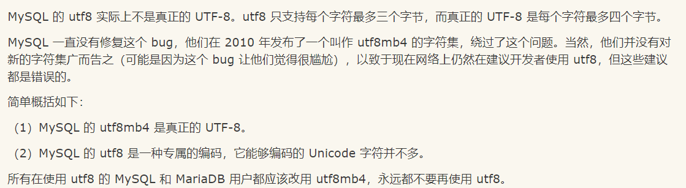
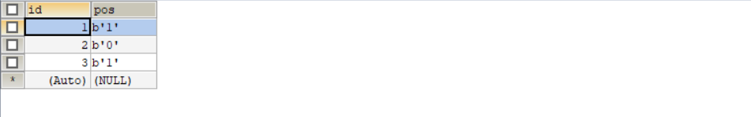
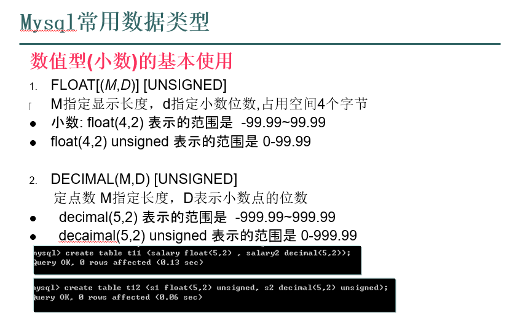
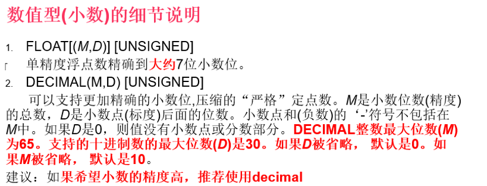

#### 远程连接数据库

```
mysql -h ip -P 3306 -uroot -proot
```

**mysql 注释**

```
#
-- 空格
/**/
select version() #xxx
select databases -- xxxx
select @@basedir /**/
```

**mysql跳过验证登陆**

#### MySQL跳过密码登录

**第一种** 
	**1.1停止mysql服务** 
	**1.2以管理员身份运行cmd，执行以下命令**

```
cd C:\Program Files\mysql-5.7.17-winx64\bin
mysqld --skip-grant-tables或者mysqld_safe --skip-grant-tables
```

​	**1.3在不关闭cmd情况下重新以管理员身份运行一个cmd，执行如下命令**

```
cd C:\Program Files\mysql-5.7.17-winx64\bin
mysql -uroot -p
alter user 'root'@'localhost' identified by '123456';
flush privileges;
注：123456是设置root的新密码
```

**第二种** 
	**2.1MySQL配置文件my.ini中，在[mysqld]下添加skip-grant-tables** 
	**2.2重启MySQL服务** 
	**2.3用管理员身份进入cmd，输入如下命令**

```
cd C:\Program Files\mysql-5.7.17-winx64\bin;
flush privileges;
alter user 'root'@'localhost' identified by '123456';
注：123456是设置root的新密码
```


**设置字符集 创建数据库**

**MySQL utf8和utf8mb4的区别**



```
create database if not exists test2 charset utf8;
show create database test2
mysql> show create database if not exists test2;

| test2    | CREATE DATABASE /*!32312 IF NOT EXISTS*/ `test2` /*!40100 DEFAULT CHARACTER SET utf8 */ |

需要注意的是:
/*!32312 IF NOT EXISTS*/ `test2` /*!40100 DEFAULT CHARACTER SET utf8 */
判断当前的数据库版本是否大于这个数字
```

**修改数据库字符集** 

**mysql utf8 真正对应的字符集为utf8mb4**

```
alter database test2 charset=utf8mb4 

mysql> create database if not exists test3 charset gbk;
Query OK, 1 row affected (0.00 sec)

mysql> show create database if not exists test3;                                                      

| Database | Create Database                                                                        | 

| test3    | CREATE DATABASE /*!32312 IF NOT EXISTS*/ `test3` /*!40100 DEFAULT CHARACTER SET gbk */ | 


mysql> alter database test3 charset=utf8mb4;
Query OK, 1 row affected (0.00 sec)

mysql> show create database if not exists test3;

| Database | Create Database                                                                            |

| test3    | CREATE DATABASE /*!32312 IF NOT EXISTS*/ `test3` /*!40100 DEFAULT CHARACTER SET utf8mb4 */ |

```

#### 数据库备份

**导出数据库中的数据(>),恢复数据库中的表(<)**

```
退出mysql 执行命令
E:\phpStudy2016\MySQL\bin
λ mysqldump -u root -p one > C:\Users\Pio\Desktop\backUp.sql
Enter password: ****
写入表到指定数据库中 也需要退出mysql数据库 test3 表示数据库名称
λ mysql -u root -p test3 < C:\Users\Pio\Desktop\backUp.sql
Enter password: ****
还原某个数据库,要求该数据库已经创建成功
```

**MySQL分组查询**

**having 和 where的区别?**

```
（也就是分组之后的各个组中进行的条件二次筛选）
having 一般用于group by 之后的条件判断
（做初步全局条件筛选）
where 用于group by之前的条件判断
```

**创建表**

```
use test3;
create table stu2(
id int unsigned auto_increment not null primary key,
name varchar(50) not null,
birthday date);


mysql> use test3;create table stu(
Database changed
    -> id int unsigned auto_increment not null primary key,
    -> name varchar(50) not null,
    -> birthday date);

mysql> show create table stu;
| stu   | CREATE TABLE `stu` (
  `id` int(10) unsigned NOT NULL AUTO_INCREMENT,
  `name` varchar(50) NOT NULL,
  `birthday` date DEFAULT NULL,
  PRIMARY KEY (`id`)
) ENGINE=MyISAM DEFAULT CHARSET=utf8mb4 |
```

**mysql 数据类型**

​	**bit**

```
mysql> create table one (id int auto_increment primary key,pos bit(1));     
                                                                            
mysql> insert into one(pos) values(1);                                      
                                                                            
mysql> insert into one(pos) values(0);                                      
                                                                            
mysql> insert into one(pos) values(10);                                     
                                                                            
mysql> select * from one;                 
+----+------+                                                               
| id | pos  |                                                               
+----+------+                                                               
|  1 | ☺    |                                                               
|  2 |      |                                                               
|  3 | ☺    |                                                               
+----+------+                                                               

一位只有 0和 1 两种取值方式，分别对应ascii中对应的值 0在这儿并没有显示
```

数据库查询显示



#### Float和decimal的区别:

​	





​	**进行验证**

```
mysql> create table two (num1 float(20,18),num2 decimal(20,18));                
Query OK, 0 rows affected (0.00 sec)                                            
                                                                                
mysql> insert into two values(0.123456789012345678,0.123456789012345678)        
    -> ;                                                                        
Query OK, 1 row affected (0.00 sec)                                             
                                                                                
mysql> select * from two;                                                       
+----------------------+----------------------+                                 
| num1                 | num2                 |                                 
+----------------------+----------------------+                                 
| 0.123456791043281560 | 0.123456789012345678 |                                 
+----------------------+----------------------+                                 
1 row in set (0.00 sec)                                                         
```

#### char和varchar的区别:

```
CHAR(size)
固定长度字符串 最大255 字符 

VARCHAR(size)   
可变长度字符串 表的单行最多65535个字符  要预留3个左右的字节 只有65532哥字节
Latin1 一个字符占一个字节，最多能存放 65532 个字符
GBK 一个字符占两个字节， 最多能存 32766 个字符
UTF8 一个字符占三个字节， 最多能存 21844 个字符

Mysql要求一个行的定义长度不能超过65535bytes，若定义的表长度超过这个值，则提示：ERROR 1118 (42000): Row size too large. The maximum row size for the used table type, not counting BLOBs, is 65535. You have to change some columns to TEXT or BLOBs

仅一个字段,会自动升级为mediumtext,否则会报错
```

```
mysql> create table overflow(id int,name varchar(65532));
ERROR 1118 (42000): Row size too large. The maximum row size for the used table type, not counting BLOBs, is 65535. You have to change some columns to TEXT or BLOBs
mysql> create table overflow(id int,name varchar(65528));
Query OK, 0 rows affected (0.00 sec)

如果格式为utf8mb4  则提示不要超过16,383

下面没有报错是因为mysql的宽松模式 这里创建表之后字段类型其实已经发生改变了

mysql> create table overflow2(id int,name varchar(65528)) charset utf8mb4;
Query OK, 0 rows affected, 1 warning (0.00 sec)

mysql> show create table overflow2;

| overflow2 | CREATE TABLE `overflow2` (
  `id` int(11) DEFAULT NULL,
  `name` mediumtext
) ENGINE=MyISAM DEFAULT CHARSET=utf8mb4 |

mysql> desc overflow2;
+-------+------------+------+-----+---------+-------+
| Field | Type       | Null | Key | Default | Extra |
+-------+------------+------+-----+---------+-------+
| id    | int(11)    | YES  |     | NULL    |       |
| name  | mediumtext | YES  |     | NULL    |       |
+-------+------------+------+-----+---------+-------+
```

**MySQL 获取字节长度**

​	**char 表示定长字符串**

​	**varchar 可变长度字符串**

​	**char 在存放空格时会丢失，varchar不会丢失存储的空格**

```
char(4)  //这个4表示字符数(绝对最大255)，不是字节数 ,不管是中文还是字母都是放四个,按字符计算.
varchar(4)//这个4表示字符数 ，不管是字母还是中文都以定义好的表的编码来存放数据.

char(4) 是定长，就是说，即使你 插入 'aa' , 也会占用 分配的4个字符.
varchar(4000)  是变长，就是说，如果你插入了 'aa',实际占用空间大小是 L+1 [注：同CHAR对比，VARCHAR值保存时只保存需要的字符数，另加一个字节来记录长度(如果列声明的长度超过255，则使用两个字节)。]

char 在存放空格时会丢失，varchar不会丢失存储的空格
比如 在 char 中存放了 ‘aa  ‘取出来值为 ‘aa'
而 varchar中存放了 ‘aa  ’ ,取出来还是 ‘aa  ’, 空格没有丢失

因为char的存放规则是当数据放入不够时，后面全面补全空格，这样就导致取出char类型的数据时会导致问题
```

```
mysql> create table difference(name char(4),name2 varchar(4)) charset utf8mb4;                                                                                                                                                        
mysql> insert into difference values('呵','呵');                                                                                                                                                                                      
mysql> select length(name),length(name2) from difference;                                    
+--------------+---------------+                                                             
| length(name) | length(name2) |                                                             
+--------------+---------------+                                                             
|            1 |             1 |                                                             
+--------------+---------------+                                                          
                                                                                             
mysql> select char_length(name),char_length(name2) from difference;                                                                           
| char_length(name) | char_length(name2) |                                                                                                  
|                 1 |                  1 |                                                                                                                                                                    
                                                                                 mysql> insert into difference values('呵 ','呵 ');                                                                                     
                                                                                  mysql> select char_length(name),char_length(name2) from difference;                          
                                               
| char_length(name) | char_length(name2) |                                                                                                   
|                 1 |                  1 |                                                   
|                 2 |                  3 |                                                                                   
```

#### 日期时间类型
**date类型： 支持的范围为'1000-01-01'到'9999-12-31'**
**datetime类型：支持的范围是'1000-01-01 00:00:00'到'9999-12-31 23:59:59’**

```
mysql> create table data_test(datename date,datetimename datetime);

mysql> insert into data_test values ('2020-10-19','2020-10-19');

mysql> insert into data_test values ('2020-10-19 15:11:35','2020-10-19 15:11:35');

mysql> select * from data_test;
+------------+---------------------+
| datename   | datetimename        |
+------------+---------------------+
| 2020-10-19 | 2020-10-19 00:00:00 |
| 2020-10-19 | 2020-10-19 15:11:35 |
+------------+---------------------+
```

枚举类型的使用

```
mysql> create table enum_test (id int,hobby enum('football','pingpang','basketball'));            
                                                                                   
mysql> insert into enum_test values (1,1);                                                        
                 
mysql> insert into enum_test values (1,2);                                                        
                                                                                                 
mysql> insert into enum_test values (1,3);                                                        

mysql> select * from enum_test;                                                                   
+------+------------+                                                                             
| id   | hobby      |                                                                             
+------+------------+                                                                             
|    1 | football   |                                                                             
|    1 | pingpang   |                                                                             
|    1 | basketball |                                                                             
+------+------------+                                                                             
mysql> insert into enum_test values (1,4);                                                        
mysql> select * from enum_test;                                                                   
+------+------------+                                                                             
| id   | hobby      |                                                                             
+------+------------+                                                                             
|    1 | football   |                                                                             
|    1 | pingpang   |                                                                             
|    1 | basketball |                                                                             
|    1 |            |                                                                             
+------+------------+                                                           
```

集合类型使用

```
mysql> create table set_test(id int,adress set('beijing','tianjing','chongqing'));                
Query OK, 0 rows affected (0.00 sec)     
mysql> insert into set_test values (1,4);                                                                                                                                
mysql> insert into set_test values (1,3);                                                         
                                                             
mysql> insert into set_test values (1,5);                                                         
mysql> select * from set_test;                                                                    
                                                                   
| id   | adress            |                                                                      
+------+-------------------+                                                                      
|    1 | chongqing         |                                                                      
|    1 | beijing,tianjing  |                                                                      
|    1 | beijing,chongqing |                                                                      
                                                                       
mysql> insert into set_test values (1,7);                                                         
mysql> select * from set_test;                                                                    
+------+----------------------------+                                                             
| id   | adress                     |                                                             
+------+----------------------------+                                                             
|    1 | chongqing                  |                                                             
|    1 | beijing,tianjing           |                                                             
|    1 | beijing,chongqing          |                                                             
|    1 | beijing,tianjing,chongqing |                                                             
+------+----------------------------+                                                                                                
```


**修改表信息**

​	**添加修改删除对应的表字段**

```
mysql> alter table set_test add username varchar(255);                                                                                                        
Records: 4  Duplicates: 0  Warnings: 0                                                      
                                                                                mysql> select * from set_test;                                                                    
                                               
| id   | adress                     | username |                                                  
                                              
|    1 | chongqing                  | NULL     |                                                  
|    1 | beijing,tianjing           | NULL     |                                                  
|    1 | beijing,chongqing          | NULL     |                                                  
|    1 | beijing,tianjing,chongqing | NULL     |                                                  
                                                                                     
mysql> alter table set_test modify username char(20);                                             
                 
mysql> desc set_test;                                                                             
          
| Field    | Type                                  | Null | Key | Default | Extra |               
          
| id       | int(11)                               | YES  |     | NULL    |       |               
| adress   | set('beijing','tianjing','chongqing') | YES  |     | NULL    |       |               
| username | char(20)                              | YES  |     | NULL    |       |               
                                                                                         
mysql> alter table set_test rename to set_test2;                                                                                                          
                                                                                 
更改表名称                                                                        mysql> alter table set_test2 drop username;                                                       
                                                          
mysql> desc set_test2;                                                                            
              
| Field  | Type                                  | Null | Key | Default | Extra |                 
               
| id     | int(11)                               | YES  |     | NULL    |       |                 
| adress | set('beijing','tianjing','chongqing') | YES  |     | NULL    |       |                 

```

**传统CRUD**

```
mysql> create table stu2 (id int auto_increment primary key not null,name varchar(50));

mysql> insert into stu2(name) values ('lili');                                                               
mysql> select * from stu2;                                                 
+----+------+                                                              
| id | name |                                                              
+----+------+                                                              
|  1 | lili |                                                                                                             
mysql> update stu2 set name='pio' where id = 10;                           

                                                                           
mysql> select * from stu2;                                                 
+----+------+                                                              
| id | name |                                                              
+----+------+                                                              
|  1 | lili |                                                              
+----+------+          

mysql> insert into stu2(name) values ('lili');                                     
mysql> insert into stu2(name) values ('puppy');                                    
mysql> select * from stu2;                                                         
+----+-------+                                                                     
| id | name  |                                                                     
+----+-------+                                                                     
|  1 | lili  |                                                                     
|  2 | lili  |                                                                     
|  3 | puppy |                                                                     
+----+-------+            

删除行
mysql> delete from stu2 where id = 3;                                              
```

count()

```
mysql> create table income(id int ,salary int);                      
                                
mysql> insert into income values(1,10000);                           
                                
mysql> insert into income values(2,20000);                           
                                 
mysql> insert into income values(3,30000);                           
                                
mysql> insert into income values(4,40000);                           
                               
mysql> select count(salary) from income;                             
+---------------+                                                    
| count(salary) |                                                    
+---------------+                                                    
|             4 |                                                    
+---------------+                                                    
                                          
mysql> select max(salary)  from income;                              
+-------------+                                                      
| max(salary) |                                                      
+-------------+                                                      
|       40000 |                                                      
+-------------+                                                      
                                            
mysql> select min(salary)  from income;                              
+-------------+                                                      
| min(salary) |                                                      
+-------------+                                                      
|       10000 |                                                      
+-------------+                                                      
                                            
mysql> select salary from income order by salary asc limit 0,1;      
+--------+                                                           
| salary |                                                           
+--------+                                                           
|  10000 |                                                           
+--------+                                                           
                                            
mysql> select salary from income order by salary desc limit 0,1;     
+--------+                                                           
| salary |                                                           
+--------+                                                           
|  40000 |                                                           
+--------+                                                           
```


