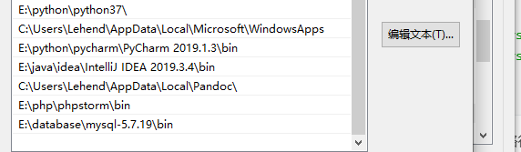
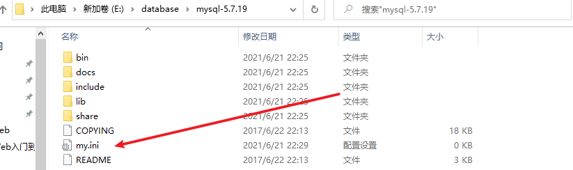
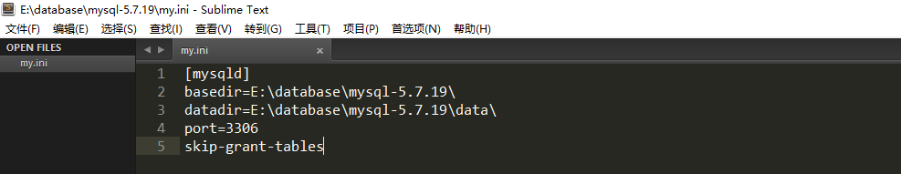
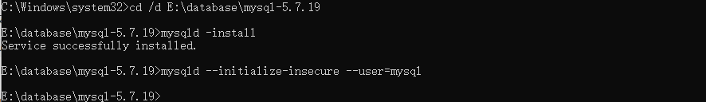
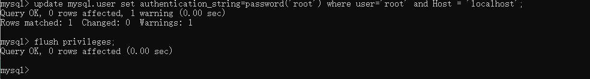
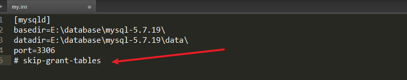
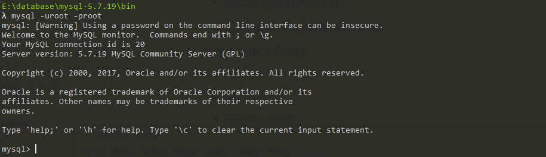
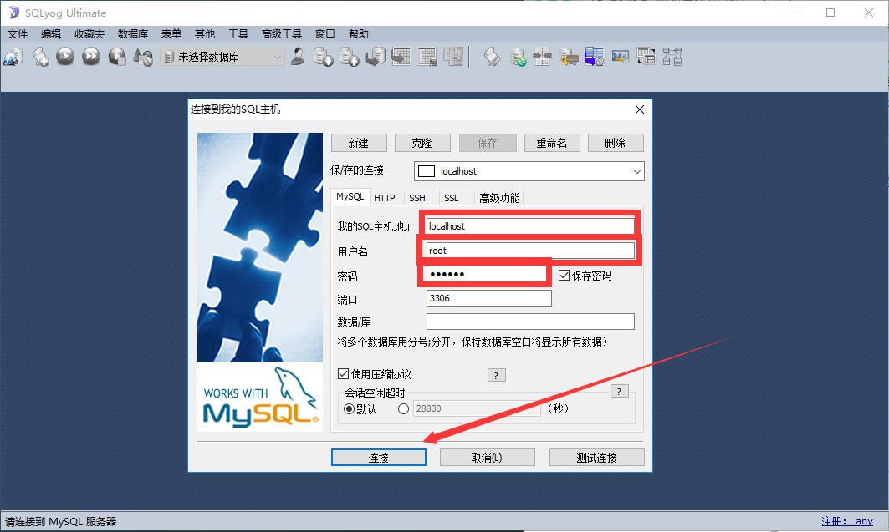

# MYSQL使用

##  **1**、初识**MySQL**

 只会写代码的是码农；学好数据库，基本能混口饭吃；在此基础上再学好操作系统和计算机网络，
 就能当一个不错的程序员。如果能再把离散数学、数字电路、体系结构、数据结构/算法、编译原理
 学通透，再加上丰富的实践经验与领域特定知识，就能算是一个优秀的工程师了。

###  **1.1**、为什么学习数据库

 1、岗位技能需求
 2、现在的世界,得数据者得天下
 3、存储数据的方法
 4、程序,网站中,大量数据如何长久保存?
 5、数据库是几乎软件体系中最核心的一个存在。

###  **1.2**、什么是数据库

 数据库 ( **DataBase** , 简称**DB** )

 **概念** : 长期存放在计算机内,有组织,可共享的大量数据的集合,是一个数据 "仓库"
 **作用** : 保存,并能安全管理数据(如:增删改查等),减少冗余...

 **数据库总览 :**

- 关系型数据库 ( SQL )

  - MySQL , Oracle , SQL Server , SQLite , DB2 , ...

  - 关系型数据库通过外键关联来建立表与表之间的关系

- 非关系型数据库 ( NOSQL )
  - Redis , MongoDB , ...
  - 非关系型数据库通常指数据以对象的形式存储在数据库中，而对象之间的关系通过每个对象自
    身的属性来决定

###  **1.3**、什么是**DBMS**

 数据库管理系统 ( **D**ata**B**ase **M**anagement **S**ystem )
 数据库管理软件 , 科学组织和存储数据 , 高效地获取和维护数据

{width="7.499998906386701in" height="10.928674540682415in"}

 为什么要说这个呢?
 因为我们要学习的MySQL应该算是一个数据库管理系统.

###  **1.4**、**MySQL**简介

{width="2.7512773403324586in" height="1.6465977690288713in"}

 **概念** **:** 是现在流行的开源的,免费的 关系型数据库

 **历史** **:** 由瑞典MySQL AB 公司开发，目前属于 Oracle 旗下产品。 

**特点 :**

-  免费 , 开源数据库
-  小巧 , 功能齐全
-  使用便捷
-  可运行于Windows或Linux操作系统
-  可适用于中小型甚至大型网站应用

 **官网 :** [**[https://www.mysql.com/]{.ul}**](https://www.mysql.com/)

###  **1.5**、安装**MySQL**

 这里建议大家使用压缩版**,**安装快**,**方便**.**不复杂**.**

####  1、软件下载

 mysql5.7 64位下载地址: 

https://dev.mysql.com/get/Downloads/MySQL-5.7/mysql-5.7.19-winx64.zip

 电脑是64位的就下载使用64位版本的！

####  2、步骤

 1、下载后得到zip压缩包.
 2、解压到自己想要安装到的目录，本人解压到的是D:Environmentmysql-5.7.19 3、添加环境变量：我的电脑-属性-高级-环境变量



```
选择PATH,在其后面添加: 你的mysql 安装文件下面的bin文件夹
```

 4、编辑 my.ini 文件 ,注意替换路径位置(没有就创建一个)





```ini
[mysqld]
basedir=E:\database\mysql-5.7.19\
datadir=E:\database\mysql-5.7.19\data\
port=3306
skip-grant-tables
```

 5、启动<font color="red">管理员</font>模式下的CMD，并将路径切换至mysql下的bin目录，然后输入mysqld --install (安装 mysql)

如果提示报错：`mysql 安装问题：由于找不到MSVCP120.dll,无法继续执行代码.重新安装程序可能会解决此问题。`

解决办法：https://www.cnblogs.com/MXL2020/p/12871203.html

 6、再输入 `mysqld --initialize-insecure --user=mysql` 初始化数据文件

 7、然后再次启动mysql 然后用命令 mysql --u root --p 进入mysql管理界面（密码可为空)

```sh
net start mysql
mysql -u root -p
```

 8、进入界面后更改root密码

```sh
update mysql.user set authentication_string=password('root') where user='root' and Host = 'localhost';
```

 9、刷新权限

```sh
flush privileges;
```



10、停止mysql，注释my.ini文件删除最后一句skip-grant-tables 




11、重启mysql即可正常使用

```sh
net stop mysql
net start mysql
```

 12、连接上测试出现以下结果就安装好了



 一步步去做 , 理论上是没有任何问题的 .
 如果您以前装过,现在需要重装,一定要将环境清理干净 .
 好了,到这里大家都装好了,因为刚接触,所以我们先不学习命令. 

这里给大家推荐一个工具 : **SQLyog** .
 即便有了可视化工具,可是基本的DOS命名大家还是要记住!

###  **1.6**、**SQLyog**

 可手动操作,管理MySQL数据库的软件工具
 特点 : 简洁 , 易用 , 图形化 {width="6.17995406824147in" height="3.699634733158355in"}

 使用SQLyog管理工具自己完成以下操作 :

- 连接本地MySQL数据库
- 新建MySchool数据库
  - 数据库名称MySchool
  - 新建数据库表(grade)
    - 字段
      - GradeID : int(11) , Primary Key (pk)
      - GradeName : varchar(50)

 在历史记录中可以看到相对应的数据库操作的语句 .

###  **1.7**、连接数据库

 打开MySQL命令窗口

- 在DOS命令行窗口进入 安装目录**mysqlbin**

- 可设置环境变量，设置了环境变量，可以在任意目录打开！

**连接数据库语句 :** `mysql -h 服务器主机地址 -u 用户名 -p 用户密码`

 <font color="red">注意 : -p后面不能加空格,否则会被当做密码的内容,导致登录失败 !</font>
 几个基本的数据库操作命令 **:**

```sql
update user set password=password('123456')where user='root'; 修改密码
flush privileges; 刷新数据库
show databases; 显示所有数据库
use dbname； 打开某个数据库
show tables; 显示数据库mysql中所有的表
describe user; 显示表mysql数据库中user表的列信息
create database name; 创建数据库
use databasename; 选择数据库
exit; 退出Mysql
? 命令关键词 : 寻求帮助
-- 表示注释
```

##  **2**、操作数据库